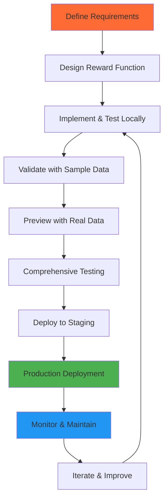

# Evaluation Workflows

This guide covers the complete lifecycle of reward function development, from initial conception to production deployment and maintenance. Understanding these workflows helps you build robust, scalable evaluation systems.

## Development Lifecycle Overview



## Phase 1: Requirements & Design

### Define Evaluation Criteria

Start by clearly defining what you want to evaluate:

```python
# requirements.md
"""
Evaluation Criteria for Math Problem Solver

Primary Metrics:
1. Accuracy (40% weight)
   - Exact answer match
   - Partial credit for correct methodology
   
2. Reasoning Quality (30% weight)
   - Step-by-step explanation
   - Mathematical notation correctness
   
3. Completeness (20% weight)
   - All required steps shown
   - Final answer clearly stated
   
4. Clarity (10% weight)
   - Language clarity
   - Logical flow

Success Criteria:
- Overall score >= 0.7
- Accuracy score >= 0.8 (critical)
- No mathematical errors
"""
```

### Design Function Interface

Plan your function signature and data requirements:

```python
# design.py
from typing import Dict, Any, List, Optional
from eval_protocol.models import EvaluateResult

def math_problem_evaluator(
    messages: List[Dict[str, Any]],
    ground_truth: Dict[str, Any],           # Expected: {"answer": "42", "steps": [...]}
    difficulty_level: str = "medium",       # "easy", "medium", "hard"
    allow_partial_credit: bool = True,
    step_weight: float = 0.3,
    **kwargs
) -> EvaluateResult:
    """
    Evaluates mathematical problem-solving responses.
    
    Args:
        messages: Conversation history with math problem and response
        ground_truth: Expected answer and solution steps
        difficulty_level: Problem difficulty for score adjustment
        allow_partial_credit: Whether to give partial credit
        step_weight: Weight for step-by-step reasoning
        
    Returns:
        EvaluateResult with accuracy, reasoning, completeness, clarity metrics
    """
    pass
```

## Phase 2: Implementation

### Basic Implementation

Start with a minimal working version:

```python
# v1_basic.py
from eval_protocol import reward_function
from eval_protocol.models import EvaluateResult, MetricResult
import re

@reward_function
def math_evaluator_v1(messages, ground_truth=None, **kwargs) -> EvaluateResult:
    """Basic math evaluator - v1.0"""
    
    if not messages or not ground_truth:
        return EvaluateResult(
            score=0.0,
            reason="Missing required inputs",
            metrics={}
        )
    
    response = messages[-1].get("content", "")
    expected_answer = str(ground_truth.get("answer", ""))
    
    # Simple exact match
    extracted_answer = extract_final_answer(response)
    accuracy = 1.0 if extracted_answer == expected_answer else 0.0
    
    return EvaluateResult(
        score=accuracy,
        reason=f"Answer {'correct' if accuracy else 'incorrect'}: {extracted_answer} vs {expected_answer}",
        metrics={
            "accuracy": MetricResult(
                score=accuracy,
                success=accuracy == 1.0,
                reason=f"Expected '{expected_answer}', got '{extracted_answer}'"
            )
        }
    )

def extract_final_answer(response: str) -> str:
    """Extract final numerical answer from response."""
    # Look for patterns like "= 42", "answer is 42", etc.
    patterns = [
        r"=\s*([+-]?\d+\.?\d*)",
        r"answer\s+is\s+([+-]?\d+\.?\d*)",
        r"final\s+answer:\s*([+-]?\d+\.?\d*)"
    ]
    
    for pattern in patterns:
        match = re.search(pattern, response, re.IGNORECASE)
        if match:
            return match.group(1)
    
    return ""
```

### Iterative Enhancement

Add features incrementally:

```python
# v2_enhanced.py
@reward_function
def math_evaluator_v2(messages, ground_truth=None, **kwargs) -> EvaluateResult:
    """Enhanced math evaluator - v2.0"""
    
    # Input validation
    validation_result = validate_inputs(messages, ground_truth)
    if validation_result:
        return validation_result
    
    response = messages[-1].get("content", "")
    metrics = {}
    
    # 1. Accuracy evaluation
    accuracy_result = evaluate_accuracy(response, ground_truth)
    metrics["accuracy"] = accuracy_result
    
    # 2. Reasoning evaluation  
    reasoning_result = evaluate_reasoning(response, ground_truth)
    metrics["reasoning"] = reasoning_result
    
    # 3. Completeness evaluation
    completeness_result = evaluate_completeness(response, ground_truth)
    metrics["completeness"] = completeness_result
    
    # 4. Clarity evaluation
    clarity_result = evaluate_clarity(response)
    metrics["clarity"] = clarity_result
    
    # Calculate weighted overall score
    weights = kwargs.get("weights", {
        "accuracy": 0.4,
        "reasoning": 0.3,
        "completeness": 0.2,
        "clarity": 0.1
    })
    
    overall_score = sum(
        metrics[metric].score * weights.get(metric, 0.0)
        for metric in metrics
    )
    
    # Determine overall success
    critical_threshold = kwargs.get("accuracy_threshold", 0.8)
    overall_success = (
        metrics["accuracy"].score >= critical_threshold and
        overall_score >= 0.7
    )
    
    return EvaluateResult(
        score=overall_score,
        reason=f"Math evaluation: {overall_score:.2f} ({'PASS' if overall_success else 'FAIL'})",
        metrics=metrics
    )
```

## Phase 3: Local Testing

### Unit Testing

Create comprehensive unit tests:

```python
# test_math_evaluator.py
import pytest
from math_evaluator import math_evaluator_v2

class TestMathEvaluator:
    
    def test_correct_answer(self):
        messages = [
            {"role": "user", "content": "What is 15 + 27?"},
            {"role": "assistant", "content": "15 + 27 = 42"}
        ]
        ground_truth = {"answer": "42", "steps": ["15 + 27", "= 42"]}
        
        result = math_evaluator_v2(messages, ground_truth)
        
        assert result.score >= 0.8
        assert result.metrics["accuracy"].score == 1.0
        assert result.metrics["accuracy"].success
    
    def test_incorrect_answer(self):
        messages = [
            {"role": "user", "content": "What is 15 + 27?"},
            {"role": "assistant", "content": "15 + 27 = 40"}
        ]
        ground_truth = {"answer": "42"}
        
        result = math_evaluator_v2(messages, ground_truth)
        
        assert result.metrics["accuracy"].score == 0.0
        assert not result.metrics["accuracy"].success
    
    def test_partial_credit(self):
        messages = [
            {"role": "user", "content": "Solve 2x + 5 = 15"},
            {"role": "assistant", "content": "2x + 5 = 15\n2x = 10\nx = 5.1"}  # Wrong final step
        ]
        ground_truth = {"answer": "5", "steps": ["2x = 10", "x = 5"]}
        
        result = math_evaluator_v2(messages, ground_truth, allow_partial_credit=True)
        
        # Should get partial credit for correct process
        assert 0.3 <= result.score <= 0.7
        assert result.metrics["reasoning"].score > 0.0
    
    def test_empty_response(self):
        messages = [
            {"role": "user", "content": "What is 2+2?"},
            {"role": "assistant", "content": ""}
        ]
        ground_truth = {"answer": "4"}
        
        result = math_evaluator_v2(messages, ground_truth)
        
        assert result.score == 0.0
        assert "empty" in result.reason.lower()

    def test_missing_ground_truth(self):
        messages = [
            {"role": "assistant", "content": "2 + 2 = 4"}
        ]
        
        result = math_evaluator_v2(messages, ground_truth=None)
        
        assert result.score == 0.0
        assert "missing" in result.reason.lower()

# Run tests
if __name__ == "__main__":
    pytest.main([__file__])
```

### Integration Testing

Test with realistic data:

```python
# integration_test.py
import json
from math_evaluator import math_evaluator_v2

def test_with_gsm8k_samples():
    """Test with actual GSM8K dataset samples."""
    
    # Load sample data
    with open("gsm8k_samples.jsonl", "r") as f:
        samples = [json.loads(line) for line in f]
    
    results = []
    for sample in samples[:10]:  # Test first 10 samples
        messages = [
            {"role": "user", "content": sample["question"]},
            {"role": "assistant", "content": sample["generated_answer"]}
        ]
        ground_truth = {"answer": sample["answer"]}
        
        result = math_evaluator_v2(messages, ground_truth)
        results.append({
            "sample_id": sample.get("id"),
            "score": result.score,
            "accuracy": result.metrics["accuracy"].score,
            "reasoning": result.metrics["reasoning"].score
        })
    
    # Analyze results
    avg_score = sum(r["score"] for r in results) / len(results)
    accuracy_rate = sum(1 for r in results if r["accuracy"] == 1.0) / len(results)
    
    print(f"Average score: {avg_score:.2f}")
    print(f"Accuracy rate: {accuracy_rate:.2%}")
    
    # Assertions for integration test
    assert avg_score >= 0.5, "Average score too low"
    assert accuracy_rate >= 0.3, "Accuracy rate too low"

if __name__ == "__main__":
    test_with_gsm8k_samples()
```

## Phase 4: Validation with Preview

### Create Sample Data

Generate representative test samples:

```python
# generate_samples.py
import json
from typing import List, Dict

def generate_math_samples() -> List[Dict]:
    """Generate diverse math problem samples for testing."""
    
    samples = [
        # Basic arithmetic
        {
            "messages": [
                {"role": "user", "content": "What is 25 + 17?"},
                {"role": "assistant", "content": "25 + 17 = 42"}
            ],
            "ground_truth": {"answer": "42", "type": "arithmetic"},
            "expected_score": 1.0
        },
        
        # Word problem
        {
            "messages": [
                {"role": "user", "content": "Sarah has 15 apples. She gives 7 to her friend. How many apples does she have left?"},
                {"role": "assistant", "content": "Sarah starts with 15 apples.\nShe gives away 7 apples.\n15 - 7 = 8\nSarah has 8 apples left."}
            ],
            "ground_truth": {"answer": "8", "type": "word_problem"},
            "expected_score": 1.0
        },
        
        # Wrong answer
        {
            "messages": [
                {"role": "user", "content": "What is 12 × 8?"},
                {"role": "assistant", "content": "12 × 8 = 92"}
            ],
            "ground_truth": {"answer": "96", "type": "arithmetic"},
            "expected_score": 0.0
        },
        
        # Partial credit case
        {
            "messages": [
                {"role": "user", "content": "Solve for x: 3x + 7 = 22"},
                {"role": "assistant", "content": "3x + 7 = 22\n3x = 15\nx = 5.1"}  # Wrong final calculation
            ],
            "ground_truth": {"answer": "5", "type": "algebra"},
            "expected_score": 0.6  # Partial credit for correct process
        }
    ]
    
    return samples

def save_samples_for_preview():
    """Save samples in format for reward-protocol preview."""
    samples = generate_math_samples()
    
    with open("math_preview_samples.jsonl", "w") as f:
        for sample in samples:
            # Format for preview command
            preview_sample = {
                "messages": sample["messages"],
                "ground_truth": sample["ground_truth"]
            }
            f.write(json.dumps(preview_sample) + "\n")
    
    print(f"Generated {len(samples)} samples for preview testing")

if __name__ == "__main__":
    save_samples_for_preview()
```

### Run Preview Testing

```bash
# Generate test samples
python generate_samples.py

# Run preview with the samples
reward-protocol preview \
  --metrics-folders "math_eval=./math_evaluator" \
  --samples math_preview_samples.jsonl \
  --verbose \
  --output preview_results.jsonl

# Analyze results
python analyze_preview_results.py
```

### Analyze Preview Results

```python
# analyze_preview_results.py
import json

def analyze_preview_results():
    """Analyze preview test results."""
    
    with open("preview_results.jsonl", "r") as f:
        results = [json.loads(line) for line in f]
    
    print("Preview Results Analysis:")
    print("=" * 40)
    
    total_samples = len(results["samples"])
    avg_score = results["summary"]["average_scores"]["overall"]
    
    print(f"Total samples: {total_samples}")
    print(f"Average score: {avg_score:.3f}")
    
    # Detailed breakdown
    for metric in ["accuracy", "reasoning", "completeness", "clarity"]:
        if metric in results["summary"]["average_scores"]:
            score = results["summary"]["average_scores"][metric]
            rate = results["summary"]["success_rates"][metric]
            print(f"{metric:12}: {score:.3f} ({rate:.1%} success)")
    
    # Individual sample analysis
    print("\nSample Breakdown:")
    for i, sample in enumerate(results["samples"]):
        score = sample["overall_score"]
        accuracy = sample["results"]["math_eval"]["metrics"]["accuracy"]["score"]
        print(f"Sample {i+1}: {score:.2f} (accuracy: {accuracy:.2f})")
    
    # Identify issues
    low_scores = [s for s in results["samples"] if s["overall_score"] < 0.5]
    if low_scores:
        print(f"\n{len(low_scores)} samples with low scores - investigate further")

if __name__ == "__main__":
    analyze_preview_results()
```

## Phase 5: Comprehensive Testing

### Dataset Evaluation

Run comprehensive evaluation with full datasets:

```python
# comprehensive_test_config.yaml
defaults:
  - dataset: gsm8k_test
  - generation: disabled  # Use existing responses
  - evaluation: math_comprehensive
  - _self_

evaluation_params:
  limit_samples: 100
  output_name: "math_eval_comprehensive_test"
  parallel_workers: 4

reward_functions:
  - name: "math_evaluator"
    module_path: "math_evaluator"
    function_name: "math_evaluator_v2"
    weights:
      accuracy: 0.4
      reasoning: 0.3
      completeness: 0.2
      clarity: 0.1
```

```bash
# Run comprehensive evaluation
reward-protocol run \
  --config-name comprehensive_test_config \
  --config-path ./configs \
  --verbose

# Generate detailed report
python generate_evaluation_report.py outputs/latest/math_eval_comprehensive_test.jsonl
```

### Performance Testing

Test performance characteristics:

```python
# performance_test.py
import time
from math_evaluator import math_evaluator_v2

def test_performance():
    """Test evaluation performance and resource usage."""
    
    # Generate test data
    large_response = "Step 1: " + "Calculate intermediate values. " * 100
    test_cases = [
        {
            "messages": [{"role": "assistant", "content": "Simple answer: 42"}],
            "ground_truth": {"answer": "42"}
        },
        {
            "messages": [{"role": "assistant", "content": large_response + "Final answer: 42"}],
            "ground_truth": {"answer": "42"}
        }
    ]
    
    # Measure performance
    times = []
    for _ in range(100):
        start_time = time.time()
        for test_case in test_cases:
            result = math_evaluator_v2(**test_case)
        end_time = time.time()
        times.append(end_time - start_time)
    
    avg_time = sum(times) / len(times)
    max_time = max(times)
    
    print(f"Average evaluation time: {avg_time:.4f}s")
    print(f"Maximum evaluation time: {max_time:.4f}s")
    
    # Performance assertions
    assert avg_time < 0.1, f"Average time too slow: {avg_time:.4f}s"
    assert max_time < 0.5, f"Maximum time too slow: {max_time:.4f}s"

if __name__ == "__main__":
    test_performance()
```

## Phase 6: Staging Deployment

### Deploy to Staging

```bash
# Deploy to staging environment
reward-protocol deploy \
  --id math-evaluator-staging \
  --display-name "Math Evaluator - Staging" \
  --description "Staging deployment for math problem evaluation" \
  --metrics-folders "math=./math_evaluator" \
  --target fireworks \
  --force \
  --verbose

# Test staging deployment
curl -X POST https://api.fireworks.ai/v1/evaluators/math-evaluator-staging/evaluate \
  -H "Authorization: Bearer $FIREWORKS_API_KEY" \
  -H "Content-Type: application/json" \
  -d '{
    "messages": [
      {"role": "user", "content": "What is 15 + 27?"},
      {"role": "assistant", "content": "15 + 27 = 42"}
    ],
    "ground_truth": {"answer": "42"}
  }'
```

### Staging Validation

```python
# staging_validation.py
import requests
import json
import os

def validate_staging_deployment():
    """Validate staging deployment functionality."""
    
    api_key = os.getenv("FIREWORKS_API_KEY")
    evaluator_id = "math-evaluator-staging"
    
    test_cases = [
        {
            "messages": [
                {"role": "user", "content": "What is 25 × 4?"},
                {"role": "assistant", "content": "25 × 4 = 100"}
            ],
            "ground_truth": {"answer": "100"},
            "expected_accuracy": 1.0
        },
        {
            "messages": [
                {"role": "user", "content": "What is 10 + 5?"},
                {"role": "assistant", "content": "10 + 5 = 16"}  # Wrong answer
            ],
            "ground_truth": {"answer": "15"},
            "expected_accuracy": 0.0
        }
    ]
    
    url = f"https://api.fireworks.ai/v1/evaluators/{evaluator_id}/evaluate"
    headers = {
        "Authorization": f"Bearer {api_key}",
        "Content-Type": "application/json"
    }
    
    for i, test_case in enumerate(test_cases):
        response = requests.post(url, json=test_case, headers=headers)
        
        assert response.status_code == 200, f"Request failed: {response.status_code}"
        
        result = response.json()
        actual_accuracy = result["metrics"]["accuracy"]["score"]
        expected_accuracy = test_case["expected_accuracy"]
        
        assert actual_accuracy == expected_accuracy, \
            f"Test {i}: Expected accuracy {expected_accuracy}, got {actual_accuracy}"
        
        print(f"Test {i+1}: PASS (accuracy: {actual_accuracy})")
    
    print("All staging validation tests passed!")

if __name__ == "__main__":
    validate_staging_deployment()
```

## Phase 7: Production Deployment

### Production Deployment

```bash
# Deploy to production
reward-protocol deploy \
  --id math-evaluator-prod \
  --display-name "Math Evaluator - Production" \
  --description "Production math problem evaluation for training pipelines" \
  --metrics-folders "math=./math_evaluator" \
  --target fireworks \
  --force

# Verify deployment
reward-protocol status --id math-evaluator-prod
```

### Blue-Green Deployment

```python
# blue_green_deployment.py
import time
import requests

def blue_green_deployment():
    """Implement blue-green deployment pattern."""
    
    # Step 1: Deploy new version alongside existing
    print("Deploying green version...")
    os.system("""
        reward-protocol deploy \
          --id math-evaluator-green \
          --metrics-folders "math=./math_evaluator_v2" \
          --force
    """)
    
    # Step 2: Run validation tests on green
    print("Validating green deployment...")
    green_valid = validate_deployment("math-evaluator-green")
    
    if not green_valid:
        print("Green deployment validation failed - keeping blue")
        return False
    
    # Step 3: Gradually shift traffic (if supported)
    print("Green deployment validated - ready for traffic switch")
    
    # Step 4: Update production pointer (manual step)
    print("Manual step: Update production configuration to use green deployment")
    
    return True

def validate_deployment(evaluator_id):
    """Validate deployment with test cases."""
    # Implementation similar to staging_validation.py
    pass

if __name__ == "__main__":
    blue_green_deployment()
```

## Phase 8: Monitoring & Maintenance

### Production Monitoring

```python
# monitoring.py
import time
import requests
import json
from datetime import datetime, timedelta

class EvaluatorMonitor:
    def __init__(self, evaluator_id, api_key):
        self.evaluator_id = evaluator_id
        self.api_key = api_key
        self.base_url = "https://api.fireworks.ai/v1"
    
    def health_check(self):
        """Perform health check on evaluator."""
        test_payload = {
            "messages": [
                {"role": "user", "content": "Test: What is 2+2?"},
                {"role": "assistant", "content": "2+2=4"}
            ],
            "ground_truth": {"answer": "4"}
        }
        
        try:
            response = requests.post(
                f"{self.base_url}/evaluators/{self.evaluator_id}/evaluate",
                json=test_payload,
                headers={"Authorization": f"Bearer {self.api_key}"},
                timeout=30
            )
            
            return {
                "status": "healthy" if response.status_code == 200 else "unhealthy",
                "response_time": response.elapsed.total_seconds(),
                "status_code": response.status_code,
                "timestamp": datetime.now().isoformat()
            }
        except Exception as e:
            return {
                "status": "error",
                "error": str(e),
                "timestamp": datetime.now().isoformat()
            }
    
    def get_usage_stats(self, days=7):
        """Get usage statistics for the evaluator."""
        # Implementation depends on available monitoring APIs
        pass
    
    def run_continuous_monitoring(self, interval_minutes=5):
        """Run continuous monitoring."""
        while True:
            health = self.health_check()
            print(f"[{health['timestamp']}] Status: {health['status']}")
            
            if health['status'] != 'healthy':
                self.alert_unhealthy(health)
            
            time.sleep(interval_minutes * 60)
    
    def alert_unhealthy(self, health_info):
        """Send alert for unhealthy status."""
        # Implement alerting (email, Slack, PagerDuty, etc.)
        print(f"ALERT: Evaluator {self.evaluator_id} is unhealthy: {health_info}")

# Usage
if __name__ == "__main__":
    monitor = EvaluatorMonitor("math-evaluator-prod", os.getenv("FIREWORKS_API_KEY"))
    monitor.run_continuous_monitoring()
```

### Performance Analytics

```python
# analytics.py
import json
from collections import defaultdict
from datetime import datetime, timedelta

def analyze_evaluation_logs():
    """Analyze evaluation performance from logs."""
    
    # Load evaluation logs (format depends on logging setup)
    with open("evaluation_logs.jsonl", "r") as f:
        logs = [json.loads(line) for line in f]
    
    # Analyze metrics
    scores = defaultdict(list)
    response_times = []
    error_count = 0
    
    for log in logs:
        if log.get("error"):
            error_count += 1
            continue
        
        # Collect scores by metric
        for metric, result in log.get("metrics", {}).items():
            scores[metric].append(result.get("score", 0.0))
        
        # Collect response times
        if "response_time" in log:
            response_times.append(log["response_time"])
    
    # Generate analytics report
    report = {
        "total_evaluations": len(logs),
        "error_rate": error_count / len(logs) if logs else 0,
        "avg_response_time": sum(response_times) / len(response_times) if response_times else 0,
        "metric_averages": {
            metric: sum(values) / len(values) 
            for metric, values in scores.items()
        }
    }
    
    print("Evaluation Analytics Report:")
    print("=" * 40)
    print(f"Total evaluations: {report['total_evaluations']}")
    print(f"Error rate: {report['error_rate']:.2%}")
    print(f"Avg response time: {report['avg_response_time']:.3f}s")
    print("\nMetric Averages:")
    for metric, avg in report['metric_averages'].items():
        print(f"  {metric}: {avg:.3f}")
    
    return report

if __name__ == "__main__":
    analyze_evaluation_logs()
```

## Best Practices Summary

### Development Best Practices
1. **Start Simple**: Begin with basic functionality and iterate
2. **Test Early**: Write tests from the beginning
3. **Document Requirements**: Clearly define evaluation criteria
4. **Version Control**: Track changes and maintain version history

### Testing Best Practices
1. **Unit Test**: Test individual components thoroughly
2. **Integration Test**: Test with realistic data
3. **Performance Test**: Measure and optimize performance
4. **Edge Case Testing**: Handle boundary conditions

### Deployment Best Practices
1. **Staging First**: Always test in staging before production
2. **Gradual Rollout**: Use blue-green or canary deployments
3. **Monitor Health**: Implement comprehensive monitoring
4. **Have Rollback Plan**: Be prepared to quickly revert changes

### Maintenance Best Practices
1. **Regular Monitoring**: Continuously monitor performance and health
2. **Log Analysis**: Regularly analyze evaluation logs
3. **Performance Optimization**: Continuously improve evaluation speed
4. **Feedback Loop**: Use production insights to improve the evaluator

## Next Steps

- Explore [Examples](/examples/overview) for complete workflow implementations
- Learn about [Integration Patterns](/integrations/overview) for different platforms
- Check [CLI Reference](/cli-reference/overview) for detailed command documentation