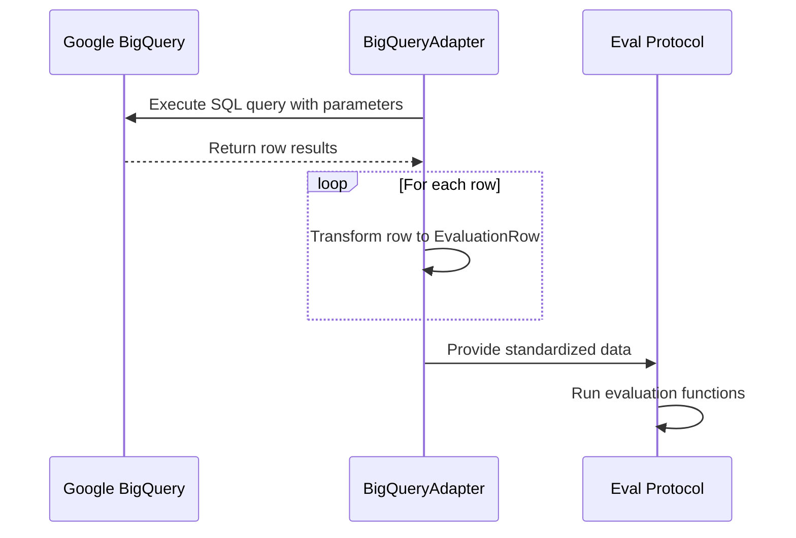

# BigQuery Adapter

The BigQuery adapter allows you to query data from Google BigQuery tables and convert them to the standardized `EvaluationRow` format for evaluation.

## Overview

Google BigQuery is a serverless, highly scalable data warehouse. The BigQuery adapter enables you to:

- Execute SQL queries against BigQuery datasets
- Transform query results to evaluation format with custom functions
- Use parameterized queries for flexible data selection
- Handle authentication via service accounts or default credentials



## Installation

To use the BigQuery adapter, you need to install the Google Cloud BigQuery dependencies:

```bash
pip install 'eval-protocol[bigquery]'
```

## Basic Usage

```python
from eval_protocol.adapters import create_bigquery_adapter

# Define a transformation function
def transform_fn(row):
    return {
        'messages': [
            {'role': 'system', 'content': 'You are a helpful assistant.'},
            {'role': 'user', 'content': row['user_query']}
        ],
        'ground_truth': row['expected_response'],
        'metadata': {'category': row.get('category')}
    }

# Create the adapter
adapter = create_bigquery_adapter(
    transform_fn=transform_fn,
    dataset_id="your-project-id",  # Google Cloud project ID
    credentials_path="/path/to/service-account.json"  # Optional
)

# Get evaluation rows
rows = list(adapter.get_evaluation_rows(
    query="SELECT * FROM `your-project.dataset.table` WHERE category = 'test'",
    limit=100
))

# Use rows in evaluation
from eval_protocol import evaluate_rows
results = evaluate_rows(rows, your_evaluation_function)
```

## Parameterized Queries

The BigQuery adapter supports parameterized queries for flexible data selection:

```python
from google.cloud import bigquery

# Create query with parameters
query = """
SELECT user_query, expected_response, category, difficulty
FROM `project.dataset.conversations`
WHERE created_date >= @start_date
  AND category = @category
  AND difficulty IN UNNEST(@difficulties)
ORDER BY created_date DESC
"""

# Define parameters
query_params = [
    bigquery.ScalarQueryParameter("start_date", "DATE", "2024-01-01"),
    bigquery.ScalarQueryParameter("category", "STRING", "customer_support"),
    bigquery.ArrayQueryParameter("difficulties", "STRING", ["easy", "medium"])
]

# Execute query with parameters
rows = list(adapter.get_evaluation_rows(
    query=query,
    query_params=query_params,
    limit=500
))
```

## Configuration Options

| Parameter | Type | Description |
|-----------|------|-------------|
| `transform_fn` | callable | Function to transform BigQuery rows |
| `dataset_id` | string | Google Cloud project ID (optional) |
| `credentials_path` | string | Path to service account JSON file (optional) |
| `location` | string | Default location for BigQuery jobs (optional) |

## Query Options

| Parameter | Type | Description |
|-----------|------|-------------|
| `query` | string | SQL query to execute |
| `query_params` | List[QueryParameter] | Optional query parameters |
| `limit` | int | Maximum number of rows to return |
| `offset` | int | Number of rows to skip |
| `model_name` | string | Model name for completion parameters |
| `temperature` | float | Temperature for completion parameters |
| `max_tokens` | int | Max tokens for completion parameters |

## BigQuery Data Types

BigQuery supports different column modes that affect how data is returned:

- **Required**: Column always has a value (never null)
- **Nullable**: Column may be null or missing  
- **Repeated**: Column contains an array of values (e.g., `['item1', 'item2', 'item3']`)

<Note>
The BigQuery adapter returns raw Python objects for all data types. For **Repeated** fields (arrays), your `transform_fn` will receive Python lists that you need to handle appropriately - whether by joining them into strings, taking specific elements, or processing them as needed for your evaluation use case.
</Note>

## Authentication

The BigQuery adapter supports multiple authentication methods:

### Service Account File

```python
adapter = create_bigquery_adapter(
    transform_fn=your_transform_fn,
    dataset_id="your-project-id",
    credentials_path="/path/to/service-account.json"
)
```

### Default Credentials

```python
# Uses Application Default Credentials (ADC)
adapter = create_bigquery_adapter(
    transform_fn=your_transform_fn,
    dataset_id="your-project-id"
)
```

### Environment Variable

```bash
export GOOGLE_APPLICATION_CREDENTIALS="/path/to/service-account.json"
```

## Troubleshooting

### Common Issues

1. **Authentication Errors**: Verify your service account has BigQuery permissions (`BigQuery Data Viewer` and `BigQuery Job User`)

2. **Query Errors**: Check your SQL syntax and ensure referenced tables exist and are accessible

3. **Missing Dependencies**: Ensure you've installed the BigQuery dependencies with `pip install 'eval-protocol[bigquery]'`

4. **Permission Denied**: Verify your service account has access to the specific datasets and tables

5. **Query Timeouts**: For large queries, consider adding `LIMIT` clauses or breaking into smaller batches

### Debug Mode

Enable debug logging to see detailed BigQuery operations:

```python
import logging
logging.basicConfig(level=logging.DEBUG)
logging.getLogger("google.cloud.bigquery").setLevel(logging.DEBUG)
```
