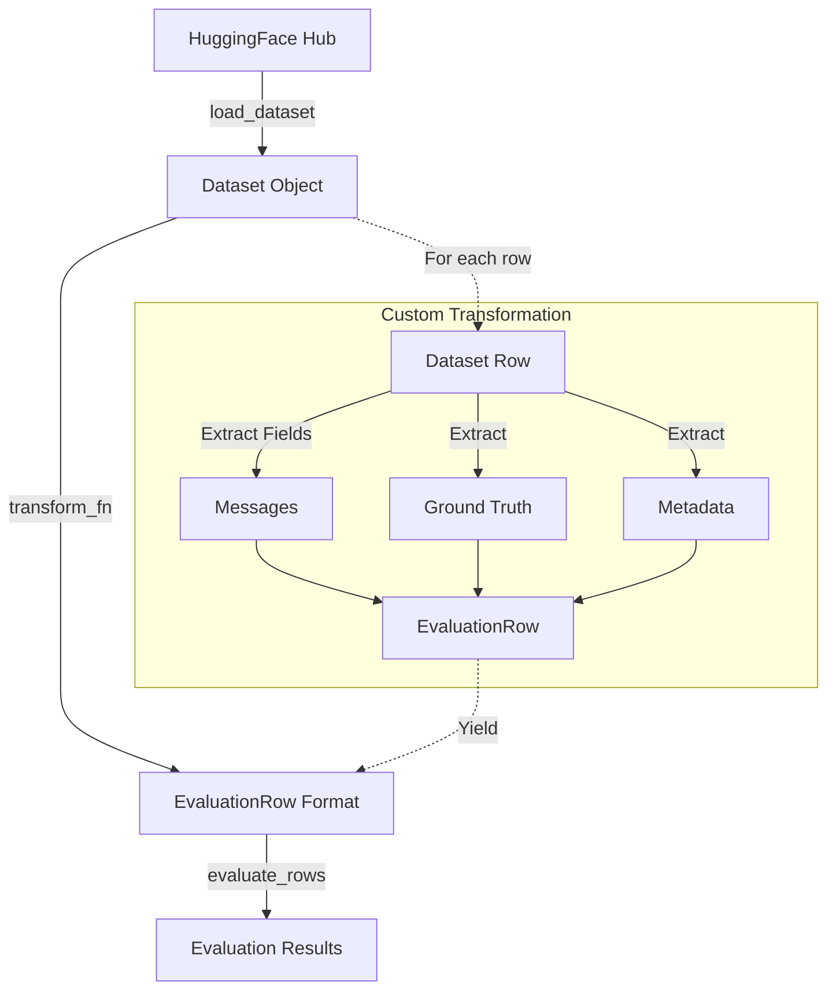

# HuggingFace Adapter

The HuggingFace adapter allows you to load datasets from the HuggingFace Hub and transform them into the standardized `EvaluationRow` format for evaluation.

## Overview

HuggingFace Datasets is a library providing access to thousands of datasets for machine learning. The HuggingFace adapter enables you to:

- Load any dataset from the HuggingFace Hub
- Transform dataset rows to the evaluation format
- Apply custom transformations for specific dataset structures
- Filter and limit dataset rows



## Installation

To use the HuggingFace adapter, you need to install the HuggingFace datasets dependencies:

```bash
pip install 'eval-protocol[huggingface]'
```

## Basic Usage

```python
from eval_protocol.adapters import create_huggingface_adapter

# Define a transformation function
def transform_fn(row):
    return {
        'messages': [
            {'role': 'system', 'content': 'You are a helpful assistant.'},
            {'role': 'user', 'content': row['question']}
        ],
        'ground_truth': row['answer'],
        'metadata': {'category': row.get('category')}
    }

# Create the adapter
adapter = create_huggingface_adapter(
    dataset_id="squad",  # HuggingFace dataset ID
    transform_fn=transform_fn  # Your transformation function
)

# Get evaluation rows
rows = list(adapter.get_evaluation_rows(
    split="validation",  # Dataset split to use
    limit=100  # Maximum number of rows
))

# Use rows in evaluation
from eval_protocol import evaluate_rows
results = evaluate_rows(rows, your_evaluation_function)
```

## Pre-built Adapters

Eval Protocol includes pre-built adapters for common datasets:

```python
from eval_protocol.adapters import create_gsm8k_adapter, create_math_adapter

# GSM8K math word problems
gsm8k_adapter = create_gsm8k_adapter()
gsm8k_rows = list(gsm8k_adapter.get_evaluation_rows(split="test", limit=10))

# General math problems
math_adapter = create_math_adapter()
math_rows = list(math_adapter.get_evaluation_rows(split="test", limit=10))
```

## Configuration Options

| Parameter | Type | Description |
|-----------|------|-------------|
| `dataset_id` | string | HuggingFace dataset identifier |
| `transform_fn` | callable | Function to transform dataset rows |
| `config_name` | string | Optional dataset configuration name |
| `revision` | string | Optional dataset revision/commit hash |

## Creating Custom Transformations

The transformation function is the key component of the HuggingFace adapter. It should take a dataset row (dictionary) and return a dictionary with the following structure:

```python
def custom_transform(row):
    return {
        'messages': [  # List of message dictionaries
            {'role': 'system', 'content': 'System prompt here'},
            {'role': 'user', 'content': row['input']},
            # Add more messages for multi-turn conversations
        ],
        'ground_truth': row['output'],  # Expected answer/output
        'metadata': {  # Optional metadata
            'source': 'dataset_name',
            'difficulty': row.get('difficulty'),
            # Any other metadata fields
        },
        'tools': []  # Optional tool definitions for tool calling scenarios
    }
```

## Example: Custom GSM8K Adapter

```python
from eval_protocol.adapters import create_huggingface_adapter
from eval_protocol import evaluate_rows
from eval_protocol.rewards.accuracy import accuracy_reward

# Custom transformation for GSM8K
def custom_gsm8k_transform(row):
    return {
        'messages': [
            {
                'role': 'system', 
                'content': 'You are a math expert. Solve the following problem step by step.'
            },
            {'role': 'user', 'content': row['question']}
        ],
        'ground_truth': row['answer'],
        'metadata': {
            'source': 'gsm8k',
            'difficulty': 'challenging'
        }
    }

# Create custom adapter
adapter = create_huggingface_adapter(
    dataset_id="gsm8k",
    config_name="main",
    transform_fn=custom_gsm8k_transform
)

# Get evaluation rows
rows = list(adapter.get_evaluation_rows(split="test", limit=20))

# Evaluate accuracy
results = evaluate_rows(rows, accuracy_reward)

# Calculate average score
avg_score = sum(r.score for r in results) / len(results) if results else 0
print(f"Average accuracy score: {avg_score:.2f}")
```

## Loading Local Datasets

You can also use the adapter with local datasets:

```python
from eval_protocol.adapters import HuggingFaceAdapter

# Create adapter from local dataset
adapter = HuggingFaceAdapter.from_local(
    path="/path/to/local/dataset",
    transform_fn=your_transform_function
)

# Get evaluation rows
rows = list(adapter.get_evaluation_rows())
```

## Troubleshooting

### Common Issues

1. **Dataset Not Found**: Verify the dataset ID and configuration name

2. **Missing Fields**: Ensure your transformation function handles the actual structure of the dataset

3. **Missing Dependencies**: Ensure you've installed the HuggingFace dependencies with `pip install 'eval-protocol[huggingface]'`

4. **Memory Issues**: For large datasets, use streaming and limit the number of rows

### Debug Mode

Enable debug logging to see detailed dataset loading information:

```python
import logging
logging.basicConfig(level=logging.DEBUG)
logging.getLogger("datasets").setLevel(logging.DEBUG)
```