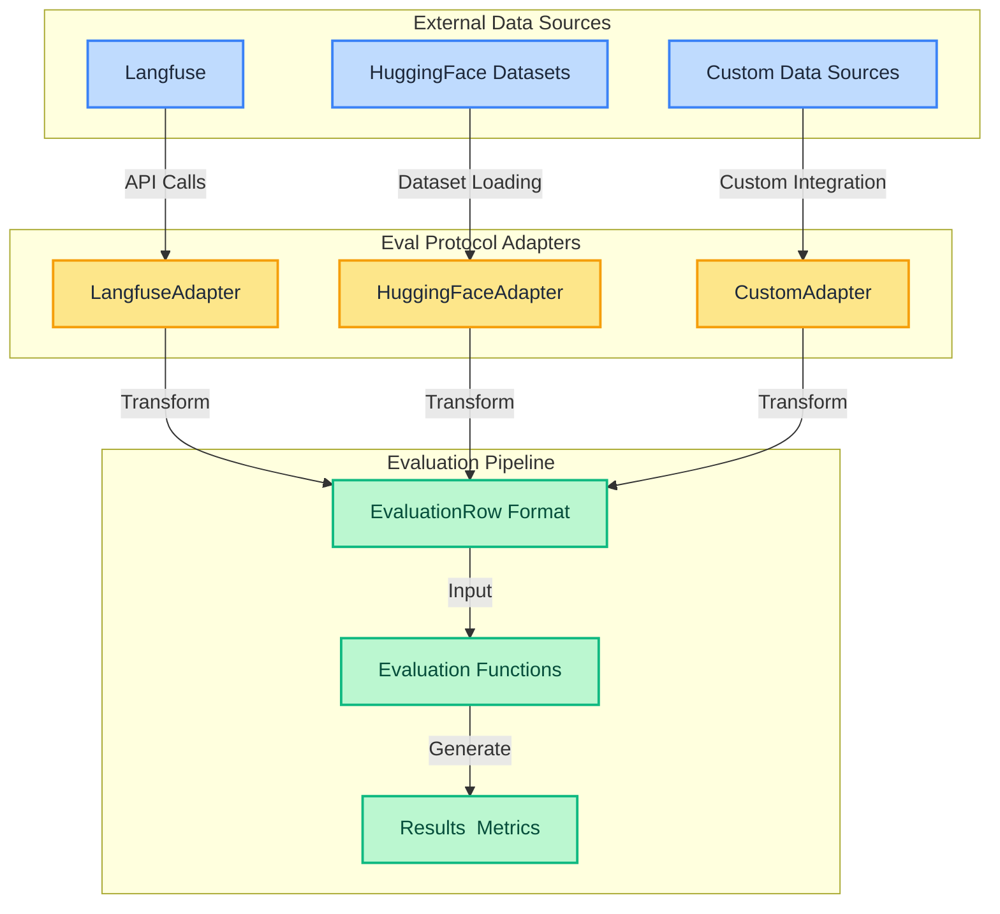

# Data Source Adapters

Eval Protocol provides adapters that allow you to easily integrate with various data sources and tracing platforms. Adapters handle the conversion of external data formats into the standardized `EvaluationRow` format used by the evaluation pipeline.

## Available Adapters

<CardGroup cols={2}>
  <Card
    title="Langfuse"
    href="/integrations/langfuse-adapter"
  >
    Pull evaluation data from Langfuse observability platform
  </Card>
  <Card
    title="HuggingFace Datasets"
    href="/integrations/huggingface-adapter"
  >
    Load and transform datasets from the HuggingFace Hub
  </Card>
  <Card
    title="Custom Adapters"
    href="#creating-custom-adapters"
  >
    Build your own adapters for any data source
  </Card>
</CardGroup>

## How Adapters Work

Adapters serve as bridges between external data sources and the Eval Protocol evaluation pipeline. They handle:

1. **Data Ingestion**: Loading data from external sources (APIs, databases, files, etc.)
2. **Format Conversion**: Converting the source data to `EvaluationRow` format
3. **Metadata Extraction**: Preserving relevant metadata from the source system
4. **Error Handling**: Gracefully handling failures and logging issues

### Adapter Architecture



## Installation

Adapters are included in the Eval Protocol package but may require additional dependencies:

```bash
# Install with all adapter dependencies
pip install 'eval-protocol[adapters]'

# Or install specific adapter dependencies
pip install 'eval-protocol[langfuse]'  # For Langfuse
pip install 'eval-protocol[huggingface]'  # For HuggingFace
```

## Creating Custom Adapters

You can create custom adapters for any data source by implementing the adapter interface:

```python
from typing import Iterator, Dict, Any
from eval_protocol.models import EvaluationRow, Message, InputMetadata

class MyCustomAdapter:
    def __init__(self, **config):
        # Initialize your data source connection
        self.config = config
        # Setup any necessary clients or connections
        
    def get_evaluation_rows(self, **kwargs) -> Iterator[EvaluationRow]:
        # Fetch data from your source
        data = self._fetch_data(**kwargs)
        
        # Convert each item to EvaluationRow format
        for item in data:
            try:
                # Create messages list
                messages = [
                    Message(role="system", content="Your system prompt"),
                    Message(role="user", content=item["input"])
                ]
                
                # Create evaluation row
                row = EvaluationRow(
                    messages=messages,
                    ground_truth=item.get("expected_output"),
                    metadata=InputMetadata(
                        source="my_custom_source",
                        id=item.get("id"),
                        # Add any other metadata
                    )
                )
                
                yield row
            except Exception as e:
                # Handle errors gracefully
                print(f"Error processing item {item.get('id')}: {e}")
                continue
```

## Contributing New Adapters

We welcome contributions of new adapters! Popular integrations that would be valuable include:

- **Observability platforms**: OTEL, Langsmith, Braintree etc.
- **Database adapters**: PostgreSQL, MongoDB, etc.
- **File format adapters**: Parquet, Excel, etc.

To contribute a new adapter:

1. Follow the adapter structure in `eval_protocol/adapters/`
2. Implement the `get_evaluation_rows()` method
3. Add appropriate tests
4. Update the `__init__.py` to conditionally import your adapter
5. Submit a pull request

See the [Contributing Guide](/community/contributing) for more details on the contribution process.