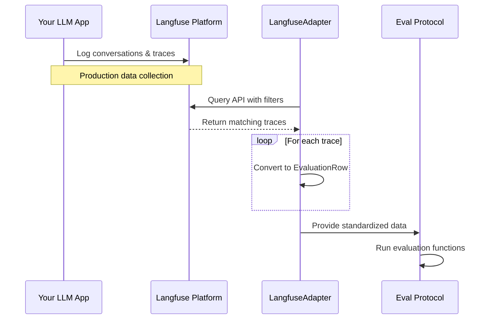

# Langfuse Adapter

The Langfuse adapter allows you to pull conversation data and tool calling traces from Langfuse deployments and convert them to the standardized `EvaluationRow` format for evaluation.

## Overview

Langfuse is an open-source observability platform for LLM applications. The Langfuse adapter enables you to:

- Pull conversation histories from production deployments
- Extract tool calling traces and function calls
- Convert complex conversation structures to evaluation format
- Filter data by tags, users, sessions, and time ranges



## Installation

To use the Langfuse adapter, you need to install the Langfuse dependencies:

```bash
pip install 'eval-protocol[langfuse]'
```

## Basic Usage

```python
from eval_protocol.adapters import create_langfuse_adapter
from datetime import datetime, timedelta

# Create the adapter
adapter = create_langfuse_adapter(
    public_key="your_public_key",
    secret_key="your_secret_key",
    host="https://cloud.langfuse.com"  # Optional, defaults to cloud.langfuse.com
)

# Get evaluation rows
rows = list(adapter.get_evaluation_rows(
    limit=50,  # Maximum number of rows to return
    tags=["production"],  # Filter by specific tags
    from_timestamp=datetime.now() - timedelta(days=7)  # Last 7 days
))

# Use rows in evaluation
from eval_protocol import evaluate_rows
results = evaluate_rows(rows, your_evaluation_function)
```

## Advanced Filtering

The Langfuse adapter supports various filtering options to target specific data:

```python
rows = adapter.get_evaluation_rows(
    limit=100,
    tags=["production", "customer-service"],  # Multiple tags (AND condition)
    user_id="specific_user_id",  # Filter by user ID
    session_id="specific_session",  # Filter by session ID
    from_timestamp=datetime(2023, 1, 1),  # From date
    to_timestamp=datetime(2023, 1, 31),  # To date
    include_tool_calls=True  # Include tool calling traces
)
```

## Configuration Options

| Parameter | Type | Description |
|-----------|------|-------------|
| `public_key` | string | Langfuse public API key |
| `secret_key` | string | Langfuse secret API key |
| `host` | string | Langfuse host URL (default: https://cloud.langfuse.com) |
| `project_id` | string | Optional project ID to filter traces |

## Filtering Options

| Parameter | Type | Description |
|-----------|------|-------------|
| `limit` | int | Maximum number of rows to return |
| `tags` | List[str] | Filter by specific tags |
| `user_id` | str | Filter by user ID |
| `session_id` | str | Filter by session ID |
| `from_timestamp` | datetime | Filter traces after this timestamp |
| `to_timestamp` | datetime | Filter traces before this timestamp |
| `include_tool_calls` | bool | Whether to include tool calling traces |

## Example: Evaluating Production Conversations

```python
from eval_protocol.adapters import create_langfuse_adapter
from eval_protocol import evaluate_rows
from eval_protocol.rewards.accuracy import accuracy_reward
from datetime import datetime, timedelta

# Create adapter for last 24 hours of production data
adapter = create_langfuse_adapter(
    public_key="your_public_key",
    secret_key="your_secret_key"
)

# Get rows with ground truth available
rows = list(adapter.get_evaluation_rows(
    limit=100,
    tags=["has_feedback"],  # Only conversations with user feedback
    from_timestamp=datetime.now() - timedelta(days=1)
))

# Evaluate accuracy
results = evaluate_rows(rows, accuracy_reward)

# Calculate average score
avg_score = sum(r.score for r in results) / len(results) if results else 0
print(f"Average accuracy score: {avg_score:.2f}")
```

## Troubleshooting

### Common Issues

1. **Authentication Errors**: Verify your API keys are correct and have the necessary permissions

2. **No Data Returned**: Check your filtering criteria - you might be using tags or time ranges that don't match any data

3. **Missing Dependencies**: Ensure you've installed the Langfuse dependencies with `pip install 'eval-protocol[langfuse]'`

4. **Rate Limiting**: If you're pulling large amounts of data, you might hit API rate limits

### Debug Mode

Enable debug logging to see detailed API requests and responses:

```python
import logging
logging.basicConfig(level=logging.DEBUG)
logging.getLogger("langfuse").setLevel(logging.DEBUG)
```