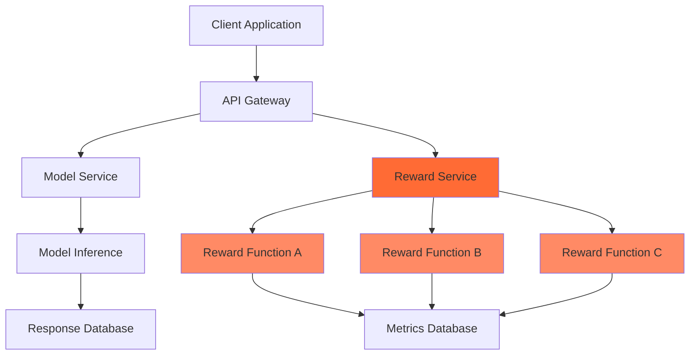
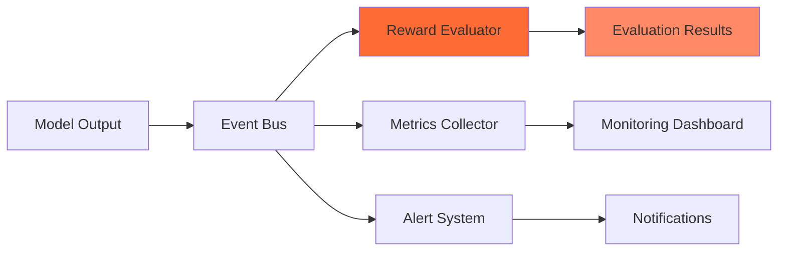
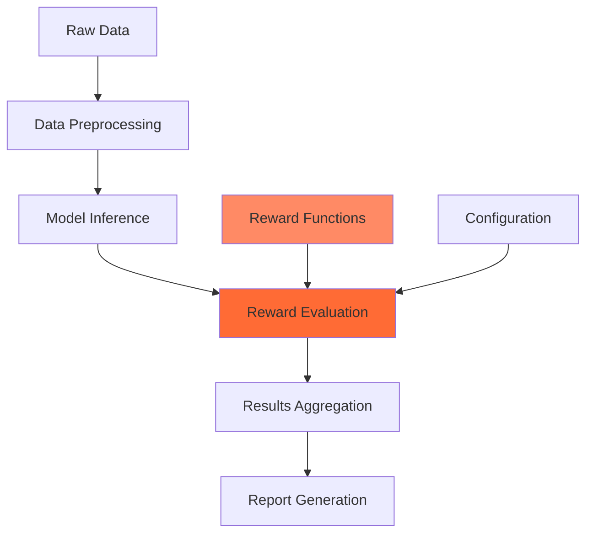

# Integrations Overview

Reward Protocol is designed to integrate seamlessly with your existing ML/AI infrastructure. This page provides an overview of supported integrations and how they work together.

## Supported Integrations

### Primary Integrations

<CardGroup cols={2}>
  <Card
    title="Fireworks AI"
    icon="fire"
    href="/integrations/fireworks"
  >
    Deploy and scale reward functions in the cloud with enterprise-grade infrastructure
  </Card>
  <Card
    title="TRL (Transformer Reinforcement Learning)"
    icon="brain"
    href="/integrations/trl"
  >
    Use reward functions in RLHF training pipelines for model alignment
  </Card>
</CardGroup>

### Additional Platform Support

<CardGroup cols={2}>
  <Card
    title="Hugging Face Transformers"
    icon="hugging-face"
    color="#ff6b35"
  >
    Direct integration with model training and evaluation workflows (Coming Soon)
  </Card>
  <Card
    title="OpenAI API"
    icon="openai"
    color="#ff6b35"
  >
    Use with OpenAI models and fine-tuning workflows (Coming Soon)
  </Card>
  <Card
    title="Braintrust"
    icon="chart-line"
    color="#ff6b35"
  >
    Connect with evaluation and monitoring platforms (Coming Soon)
  </Card>
  <Card
    title="Weights & Biases"
    icon="weight"
    color="#ff6b35"
  >
    Track experiments and model performance metrics (Coming Soon)
  </Card>
</CardGroup>

### Enterprise Orchestration

<CardGroup cols={2}>
  <Card
    title="Apache Airflow"
    icon="workflow"
    color="#ff6b35"
  >
    Orchestrate large-scale evaluation pipelines (Enterprise Feature)
  </Card>
  <Card
    title="Apache Spark"
    icon="spark"
    color="#ff6b35"
  >
    Scale evaluation across distributed clusters (Enterprise Feature)
  </Card>
</CardGroup>

## Integration Patterns

### 1. Training-Time Integration
Use reward functions during model training:

```python
from reward_protocol import load_function
from transformers import Trainer

# Load your reward function
reward_fn = load_function("code_quality_evaluator")

# Custom trainer with reward-based evaluation
class RewardTrainer(Trainer):
    def compute_loss(self, model, inputs, return_outputs=False):
        # Standard training loss
        loss = super().compute_loss(model, inputs, return_outputs)
        
        # Add reward-based regularization
        if self.args.use_reward_regularization:
            outputs = model(**inputs)
            predictions = self.tokenizer.decode(outputs.logits.argmax(-1))
            
            reward_scores = [
                reward_fn(query, pred) 
                for query, pred in zip(inputs['queries'], predictions)
            ]
            
            reward_loss = -torch.mean(torch.tensor(reward_scores))
            loss += 0.1 * reward_loss
        
        return loss
```

### 2. Evaluation-Time Integration
Use reward functions for model evaluation:

```python
from reward_protocol import BatchProcessor
import pandas as pd

# Set up batch processor
processor = BatchProcessor()
processor.add_function("math_accuracy")
processor.add_function("code_quality")
processor.add_function("factual_correctness")

# Evaluate model outputs
def evaluate_model_outputs(dataset_path: str):
    df = pd.read_csv(dataset_path)
    
    # Batch evaluation
    results = processor.process_dataframe(df)
    
    # Aggregate results
    metrics = {
        'math_accuracy': results['math_accuracy'].mean(),
        'code_quality': results['code_quality'].mean(),
        'factual_correctness': results['factual_correctness'].mean(),
        'overall_score': results[['math_accuracy', 'code_quality', 'factual_correctness']].mean(axis=1).mean()
    }
    
    return metrics
```

### 3. Serving-Time Integration
Use reward functions in production serving:

```python
from reward_protocol import RewardProtocol
from fastapi import FastAPI

app = FastAPI()
protocol = RewardProtocol()

# Load reward functions
quality_evaluator = protocol.load_function("response_quality")
safety_evaluator = protocol.load_function("safety_filter")

@app.post("/generate")
async def generate_response(query: str):
    # Generate response from your model
    response = await your_model.generate(query)
    
    # Evaluate response quality
    quality_score = quality_evaluator(query, response)
    safety_score = safety_evaluator(query, response)
    
    # Filter low-quality or unsafe responses
    if quality_score < 0.7 or safety_score < 0.9:
        response = await your_model.generate(query, retry=True)
    
    return {
        "response": response,
        "quality_score": quality_score,
        "safety_score": safety_score
    }
```

## Common Integration Architectures

### Microservices Architecture


### Event-Driven Architecture


### Batch Processing Pipeline


## Configuration Management

### Environment-Specific Configuration
```yaml
# config/development.yaml
reward_protocol:
  functions:
    - name: math_accuracy
      source: local
      path: ./functions/math.py
    - name: code_quality
      source: local
      path: ./functions/code.py
  
  cache:
    enabled: true
    size: 1000
  
  monitoring:
    enabled: false

# config/production.yaml
reward_protocol:
  functions:
    - name: math_accuracy
      source: fireworks
      version: "1.2.0"
    - name: code_quality
      source: fireworks
      version: "2.0.0"
  
  cache:
    enabled: true
    size: 10000
    redis_url: "redis://cache:6379"
  
  monitoring:
    enabled: true
    metrics_endpoint: "http://prometheus:9090"
```

### Dynamic Configuration
```python
from reward_protocol import ConfigManager

config = ConfigManager()

# Load configuration from multiple sources
config.load_from_file("config/base.yaml")
config.load_from_env()
config.load_from_consul("reward-protocol/config")

# Use configuration
protocol = RewardProtocol(config)
```

## Best Practices

### 1. Gradual Integration
- Start with non-critical evaluation workflows
- Test thoroughly in staging environments
- Monitor performance impact
- Gradually expand to production systems

### 2. Monitoring & Observability
- Track evaluation latency and throughput
- Monitor reward function accuracy
- Set up alerts for evaluation failures
- Log detailed metrics for debugging

### 3. Error Handling
- Implement fallback mechanisms
- Handle network failures gracefully
- Provide default scores for critical paths
- Log errors for later analysis

### 4. Security
- Use secure communication channels
- Validate all inputs and outputs
- Implement proper authentication
- Regular security audits

## Getting Started

1. **Choose Your Integration**: Select the platform you want to integrate with
2. **Read the Guide**: Follow the detailed integration guide for your platform
3. **Test Locally**: Validate the integration in your development environment
4. **Deploy Gradually**: Roll out to production incrementally
5. **Monitor**: Set up monitoring and alerting for your integration

## Need Help?

- **Integration Guides**: Check platform-specific documentation
- **Community**: Ask questions in our [Discord](https://discord.gg/reward-protocol)
- **Support**: Contact our [support team](/community/support)
- **Custom Integration**: Reach out for [enterprise support](/community/feedback)