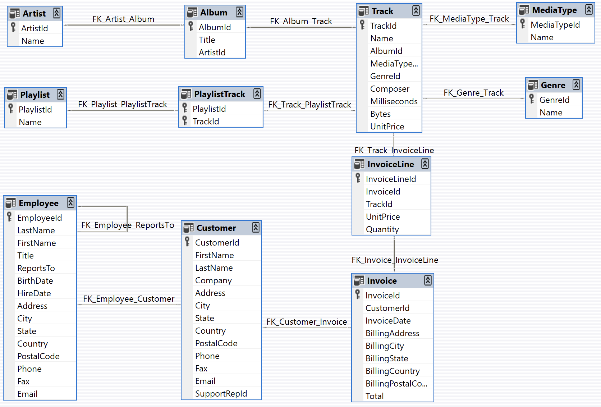
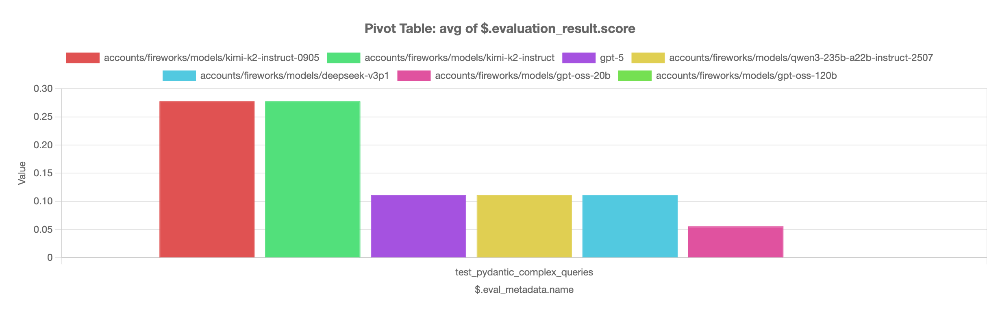

To make it easy to build a model leaderboard for Pydantic AI agents,
`eval-protocol` provides an out-of-the-box rollout processor for Pydantic AI
agents.

## `PydanticAgentRolloutProcessor`

This orchestrates rollouts for Pydantic AI agents so you only need to pass an
agent factory function and `eval-protocol` will handle running your experiments
against your dataset.

```python highlight={9}
@evaluation_test(
    input_rows=[collect_dataset()],
    completion_params=[
        {
            "model": "accounts/fireworks/models/kimi-k2-instruct",
            "provider": "fireworks",  # Optional: defaults to "openai"
        },
    ],
    rollout_processor=PydanticAgentRolloutProcessor(agent_factory),
)
async def test_pydantic_complex_queries(row: EvaluationRow) -> EvaluationRow:
    ...
```

See [reference](/reference/rollout-processors#pydanticagentrolloutprocessor) for more details.

## Agent Factory

To supply an agent for evaluation, you need to define an agent factory function.
An agent factory is a function of type `Callable[[RolloutProcessorConfig],
Agent]`. See [reference](/reference/evaluation-test#rolloutprocessorconfig) for more details.

In this example, we assume you have a `setup_agent` function that creates a
Pydantic AI agent using a given model.

```python
from pydantic_ai import Agent
from pydantic_ai.models.openai import OpenAIChatModel
from eval_protocol.pytest.types import RolloutProcessorConfig

def agent_factory(config: RolloutProcessorConfig) -> Agent:
    model_name = config.completion_params["model"]
    # Provider is optional - defaults to "openai" if not specified
    provider = config.completion_params.get("provider", "openai")
    model = OpenAIChatModel(model_name, provider=provider)
    return setup_agent(model)
```

Use the `completion_params` to get the model name. The `provider` field is optional
and defaults to "openai" if not specified. The `model` field is the canonical way to
pass the model name to most LLM clients.


## Chinook Database Example

<Note>
See example Pydantic AI example eval code [here](https://github.com/eval-protocol/python-sdk/blob/main/tests/chinook/pydantic/test_pydantic_complex_queries.py).
</Note>


For illustration, let's build an AI agent to help answer questions about the
[Chinook database](https://github.com/lerocha/chinook-database), an open-source
sample database that represents a digtal media store, including tables for
artists, albums, tracks, invoices, and customers.

<Accordion title="Chinook Database Schema">



</Accordion>

### Agent 

Our Pydantic AI agent
([source](https://github.com/eval-protocol/python-sdk/blob/main/tests/chinook/pydantic/agent.py))
has access to the database through the provided `execute_sql` tool and the
entire database schema is injected into the system prompt.  The agent should be
able to use the tool to query data and summarize the results to help answer
questions about the dataset.

<Note>

Before creating your eval, you will need to parameterize your agent so that you
can evaluate it with different models. In the this example we wrap our agent
creation logic in a function called `setup_agent` that accepts a pydantic
[`Model` 
object](https://ai.pydantic.dev/api/models/base/#pydantic_ai.models.Model). You
can reuse this pattern in your own setup, but it is not required.

```python
def setup_agent(orchestrator_agent_model: Model):
    # ...
    agent = Agent(
        system_prompt=SYSTEM_PROMPT,
        model=orchestrator_agent_model,
        instrument=True,
    )
    # ...
    return agent
```

</Note>

### Tasks

To evaluate our agent, we curated a set of complex tasks and their ground truth
answers that we can use to evaluate the quality of the agent (dataset
[here](https://github.com/eval-protocol/python-sdk/tree/main/tests/chinook/dataset)).

For example, here is one of the tasks for our eval:

```txt
Find the top 5 customers by total spending, including their favorite genre. Show
customer name, favorite genre, total invoices, total spent, and spending rank.
```

And here is the ground truth answer:

| customer_name      | favorite_genre | total_invoices | total_spent | spending_rank |
| ------------------ | -------------- | -------------- | ----------- | ------------- |
| Helena Holý        | Rock           | 7              | 49.62       | 1             |
| Richard Cunningham | Rock           | 7              | 47.62       | 2             |
| Luis Rojas         | Rock           | 7              | 46.62       | 3             |
| Ladislav Kovács    | Rock           | 7              | 45.62       | 4             |
| Hugh O'Reilly      | Rock           | 7              | 45.62       | 4             |

For each task, the agent should be evaluated on its ability to collect data
through SQL calls and pass through or give a high-quality summary of the correct
data for the task.

## Writing the Eval

Evals in `eval-protocol` return a [score](/specification#evaluateresult) between 0.0 and 1.0. For this example,
we will give either a score of 0 or 1 depending on whether the final answer from
the agent contains the same or well summarized information as the data shown in
the ground truth. 


### Reading the Dataset

Every eval in `eval-protocol` expects an input dataset of type [List[EvaluationRow]](/specification#evaluationrow).

In our example, we define a [`collect_dataset`
function](https://github.com/eval-protocol/python-sdk/blob/main/tests/chinook/dataset.py)
that helps us read tasks and ground truth answers from the dataset folder.

### Generating a Score

Evals in `eval-protocol` return a [score](/specification#evaluateresult) between 0.0 and 1.0. For this example,
we use an LLM-based judge to compare the agent's response against the ground truth answer.

Here's the complete scoring implementation from the test:

```python
import os
from pydantic import BaseModel
from pydantic_ai import Agent
from pydantic_ai.models.openai import OpenAIModel
import pytest

from eval_protocol.models import EvaluateResult, EvaluationRow
from eval_protocol.pytest import evaluation_test
from eval_protocol.pytest.types import RolloutProcessorConfig
from tests.chinook.dataset import collect_dataset
from tests.chinook.pydantic.agent import setup_agent
from tests.pytest.test_pydantic_agent import PydanticAgentRolloutProcessor

LLM_JUDGE_PROMPT = (
    "Your job is to compare the response to the expected answer.\n"
    "The response will be a narrative report of the query results.\n"
    "If the response contains the same or well summarized information as the expected answer, return 1.0.\n"
    "If the response does not contain the same information or is missing information, return 0.0."
)

def agent_factory(config: RolloutProcessorConfig) -> Agent:
    model_name = config.completion_params["model"]
    provider = config.completion_params.get("provider", "openai")
    model = OpenAIChatModel(model_name, provider=provider)
    return setup_agent(model)

@pytest.mark.skipif(
    os.environ.get("CI") == "true",
    reason="Only run this test locally (skipped in CI)",
)
@pytest.mark.asyncio
@evaluation_test(
    input_rows=[collect_dataset()],
    completion_params=[
        {
            "model": "accounts/fireworks/models/kimi-k2-instruct",
            "provider": "fireworks",  # Optional: defaults to "openai"
        },
    ],
    rollout_processor=PydanticAgentRolloutProcessor(agent_factory),
)
async def test_pydantic_complex_queries(row: EvaluationRow) -> EvaluationRow:
    """
    Evaluation of complex queries for the Chinook database using PydanticAI
    """
    last_assistant_message = row.last_assistant_message()
    if last_assistant_message is None:
        row.evaluation_result = EvaluateResult(
            score=0.0,
            reason="No assistant message found",
        )
    elif not last_assistant_message.content:
        row.evaluation_result = EvaluateResult(
            score=0.0,
            reason="No assistant message found",
        )
    else:
        model = OpenAIModel(
            "accounts/fireworks/models/kimi-k2-instruct",
            provider="fireworks",
        )

        class Response(BaseModel):
            """
            A score between 0.0 and 1.0 indicating whether the response is correct.
            """

            score: float

            """
            A short explanation of why the response is correct or incorrect.
            """
            reason: str

        comparison_agent = Agent(
            model=model,
            system_prompt=LLM_JUDGE_PROMPT,
            output_type=Response,
            output_retries=5,
        )
        result = await comparison_agent.run(
            f"Expected answer: {row.ground_truth}\nResponse: {last_assistant_message.content}"
        )
        row.evaluation_result = EvaluateResult(
            score=result.output.score,
            reason=result.output.reason,
        )
    return row
```

#### How the Scoring Works

1. **Agent Factory**: The `agent_factory` function creates a Pydantic AI agent using the model from `completion_params` (provider is optional)

2. **LLM Judge**: A separate Pydantic AI agent (`comparison_agent`) is created to evaluate responses using a structured prompt

3. **Structured Output**: The judge uses a Pydantic `Response` model to ensure consistent scoring format with both a score (0.0-1.0) and reasoning

4. **Error Handling**: The code checks for missing or empty assistant messages and assigns a score of 0.0

5. **Comparison**: The judge compares the agent's response against the ground truth and returns a structured evaluation

6. **Retry Logic**: Uses `output_retries=5` to ensure reliable structured output from the judge

This approach provides both automated scoring and human-readable explanations for why each response was scored the way it was.

### Creating a Leaderboard

Now that we have a scoring function, we can create a leaderboard. 

#### Step 1: Add Multiple Models

To compare different models, modify the `completion_params` in your `@evaluation_test` decorator to include multiple models. Set `num_runs=3` to generate multiple samples per row, providing more robust evaluation results by running each test case 3 times:

```python @evaluation_test decorator changes icon="code" lines
@evaluation_test(
    input_rows=[collect_dataset()],
    completion_params=[
        {
            "model": "accounts/fireworks/models/kimi-k2-instruct",
            "provider": "fireworks",  # Optional
        },
        { # [!code ++]
            "model": "gpt-5", # [!code ++]
            # provider defaults to "openai" # [!code ++]
        }, # [!code ++]
        { # [!code ++]
            "model": "accounts/fireworks/models/kimi-k2-instruct-0905", # [!code ++]
            "provider": "fireworks", # [!code ++]
        }, # [!code ++]
        { # [!code ++]
            "model": "accounts/fireworks/models/qwen3-235b-a22b-instruct-2507", # [!code ++]
            "provider": "fireworks", # [!code ++]
        }, # [!code ++]
        { # [!code ++]
            "model": "accounts/fireworks/models/deepseek-v3p1", # [!code ++]
            "provider": "fireworks", # [!code ++]
        }, # [!code ++]
        { # [!code ++]
            "model": "accounts/fireworks/models/gpt-oss-120b", # [!code ++]
            "provider": "fireworks", # [!code ++]
        }, # [!code ++]
        { # [!code ++]
            "model": "accounts/fireworks/models/gpt-oss-20b", # [!code ++]
            "provider": "fireworks", # [!code ++]
        }, # [!code ++]
    ],
    num_runs=3, # [!code ++]
    rollout_processor=PydanticAgentRolloutProcessor(agent_factory),
)
```

#### Step 2: Run the Evaluation

Execute your evaluation test to generate results across all models:

<Tabs>
  <Tab title="CLI">
    ```bash
    pytest tests/chinook/pydantic/test_pydantic_complex_queries.py -v
    ```
  </Tab>
  <Tab title="VSCode">
    - Open the test file in VSCode
    - Click the "Run Test" button above the test function
    - Or use the Command Palette (`Cmd+Shift+P`) and search for "Tests: Run Tests in Current File"
  </Tab>
</Tabs>

#### Step 3: View Results in Pivot View

After running the evaluation, you can analyze the results using the [Pivot View](/tutorial/ui/pivot). The pivot view allows you to:

- Compare model performance across different metrics
- Create visualizations and charts
- Export results as images or CSV files
- Filter and aggregate data by various dimensions

<Frame caption={<span>Example leaderboard showing model performance comparison in the Pivot View.</span>}>

</Frame>

The leaderboard shows that `kimi-k2-instruct-0905` and `kimi-k2-instruct` models perform best on the complex queries evaluation, significantly outperforming other models in the comparison.

