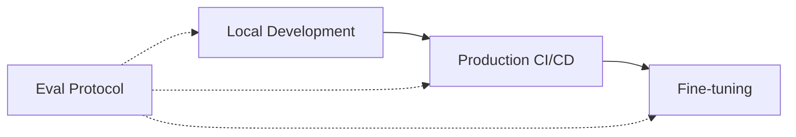

EP is an open [specification](/specification) and [Python
SDK](https://github.com/eval-protocol/python-sdk) that standardizes how
developers author evals for large lanuage models (LLM) applications. It ensures
that writing evals and storing eval results can be reused across model
selection, prompt engineering, and production CI/CD, to fine-tuning for
real-world use cases—from markdown and JSON generation to customer service
agents.

To illustrate, here is a simple example of an evaluation function that evaluates
responses from a [Policy](/specification#policy) based on the number of bullet
points in the response.

```python
# IFEval simple example
```

For a more advanced example, check out our implementation of [𝜏²-bench](#), a
benchmark for evaluating conversational agents in a dual control environment.

### Why Eval Protocol?

AI app quality is a complex problem to solve. There are many different inputs
into creating better AI systems: prompts, model, data, environment, and the
evals themselves. Eval Protocol was created to help developers scale their evals
as their AI app requirements grow in complexity.

In the beginning of building an AI application, its convenient to write evals in
ad-hoc eval scripts like the following:

```python
import httpx
from openai import OpenAI

client = OpenAI()

article = "..."

SYSTEM_PROMPT = """
You are a helpful assistant that summarized articles into bullet points. You
will be given an article and you will need to summarize it into 5 bullet
points. 

- ALWAYS make sure to write the summary as 5 bullet points.
- ALWAYS generate a response in markdown format.
"""

# evaluate article
response = client.chat.completions.create(
    model="gpt-4o",
    messages=[
        {"role": "system", "content": SYSTEM_PROMPT},
        {"role": "user", "content": article}
    ]
)

EVAL_PROMPT = """
  You are a helpful assistant that ensures that the provided response is a list of 5 bullet points.
"""
```

This works well for small projects, but as requirements grow, it becomes harder
to maintain and reuse evals across different projects. Developers often bootstrap their own harness for 

### The Vision

As AI application developers continue to adopt Eval Protocol, we expect to see a
more standardized approach to writing evals that can be helpful for all parts of
the AI application development lifecycle.


