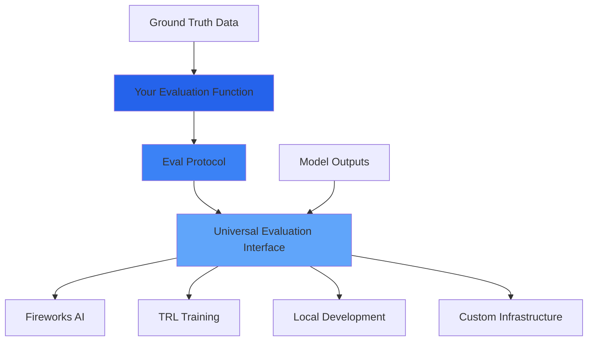
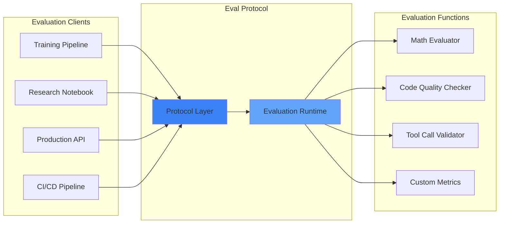

# Eval Protocol

**Eval Protocol is like a universal adapter for AI evaluation — it allows evaluation functions to work seamlessly across any platform, infrastructure, or training pipeline.**

Just as USB-C provides a universal standard for device connectivity, Eval Protocol establishes a universal standard for AI model evaluation, enabling evaluation functions to be written once and deployed anywhere.

## Why Eval Protocol?

Building effective AI evaluation systems today is needlessly complex and fragmented:

- **No Universal Standard**: Every platform requires custom evaluation code, making it difficult to share and reuse evaluation functions
- **Infrastructure Lock-in**: Evaluation logic gets tied to specific platforms, preventing flexible deployment
- **Development Friction**: Setting up evaluation pipelines requires extensive boilerplate and platform-specific knowledge
- **Limited Portability**: Evaluation functions can't easily move between research, training, and production environments

Eval Protocol solves these problems by providing **a single, standardized way to define evaluation functions that work everywhere**.

## How Eval Protocol Works

### The Eval Protocol Advantage

**Write Once, Deploy Anywhere**: Define your evaluation logic once using the `@evaluation_function` decorator, then deploy it across any platform or infrastructure without modification.

**Universal Data Types**: Standardized input/output formats ensure your evaluation functions work consistently across different data sources and evaluation contexts.

**Built-in Best Practices**: The protocol includes built-in support for metrics tracking, error handling, and evaluation result structuring.

## Core Benefits

<CardGroup cols={2}>
  <Card
    title="Universal Compatibility"
    icon="plug"
    href="/quickstart"
  >
    Write evaluation functions once, deploy anywhere — from local testing to production training pipelines
  </Card>
  <Card
    title="Zero Lock-in"
    icon="unlock"
    href="/quickstart"
  >
    Switch between platforms, cloud providers, and infrastructures without rewriting evaluation logic
  </Card>
  <Card
    title="Developer Experience"
    icon="code"
    href="/developer-guide/getting-started"
  >
    Simple `@evaluation_function` decorator with rich type safety and comprehensive tooling
  </Card>
  <Card
    title="Production Ready"
    icon="rocket"
    href="/cli-reference/overview"
  >
    Built-in CLI for testing, deployment, and monitoring with enterprise-grade reliability
  </Card>
</CardGroup>

## Architecture Overview

Eval Protocol uses a **client-server model** where evaluation functions act as specialized evaluation servers that can be called by various AI training and evaluation clients.

### Key Components

- **Evaluation Clients**: Any system that needs to evaluate AI model outputs — training pipelines, research environments, production APIs
- **Protocol Layer**: Standardized communication interface that handles authentication, data serialization, and error management
- **Evaluation Runtime**: Executes evaluation functions in isolated, scalable environments with proper resource management
- **Evaluation Functions**: Your custom evaluation logic, packaged as portable, reusable components

## Getting Started

Choose your path based on what you want to accomplish:

<CardGroup cols={3}>
  <Card
    title="Evaluation Function Developers"
    icon="code"
    href="/quickstarts/developers"
  >
    Build and deploy custom evaluation logic for AI models
  </Card>
  <Card
    title="ML Engineers"
    icon="cog"
    href="/quickstarts/users"
  >
    Integrate existing evaluation functions into your training pipelines
  </Card>
  <Card
    title="Platform Integrators"
    icon="plug"
    href="/quickstarts/integrators"
  >
    Add Eval Protocol support to your evaluation platform
  </Card>
</CardGroup>

<CardGroup cols={2}>
  <Card
    title="Installation & Setup"
    icon="download"
    href="/installation"
  >
    - **Install Eval Protocol and configure your development environment
  </Card>
  <Card
    title="5-Minute Quickstart"
    icon="bolt"
    href="/quickstart"
  >
    Create, test, and deploy your first evaluation function
  </Card>
</CardGroup>

## Real-World Applications

Eval Protocol powers evaluation across diverse AI use cases:

<CardGroup cols={2}>
  <Card
    title="Mathematical Reasoning"
    icon="calculator"
    href="/examples/math-evaluation"
  >
    Evaluate step-by-step problem solving, formula correctness, and numerical accuracy
  </Card>
  <Card
    title="Code Generation & Quality"
    icon="terminal"
    href="/examples/overview"
  >
    Test syntax correctness, functionality, efficiency, and coding best practices
  </Card>
  <Card
    title="Function Calling & Tool Use"
    icon="tools"
    href="/examples/overview"
  >
    Verify API calls, parameter matching, and multi-step tool orchestration
  </Card>
  <Card
    title="Conversational AI Quality"
    icon="message-circle"
    href="/development/getting-started"
  >
    Assess helpfulness, safety, factual accuracy, and adherence to guidelines
  </Card>
  <Card
    title="Domain-Specific Metrics"
    icon="gauge"
    href="/development/getting-started"
  >
    Create specialized evaluation criteria for finance, healthcare, legal, and other domains
  </Card>
  <Card
    title="Training Pipeline Integration"
    icon="repeat"
    href="/integrations/overview"
  >
    Integrate with RLHF, constitutional AI, and other alignment training methods
  </Card>
</CardGroup>

## Learn Eval Protocol

<CardGroup cols={2}>
  <Card
    title="Core Concepts Tutorial"
    icon="graduation-cap"
    href="/developer-guide/getting-started"
  >
    Master the fundamentals of evaluation function design and implementation
  </Card>
  <Card
    title="Best Practices Guide"
    icon="shield-check"
    href="/development/getting-started"
  >
    Learn proven patterns for robust, scalable evaluation systems
  </Card>
  <Card
    title="Advanced Examples"
    icon="layers"
    href="/examples/overview"
  >
    Explore complex, real-world evaluation function implementations
  </Card>
  <Card
    title="API & CLI Reference"
    icon="book-open"
    href="/api-reference/overview"
  >
    Complete technical documentation for all features and commands
  </Card>
</CardGroup>

## Explore the Ecosystem

<CardGroup cols={2}>
  <Card
    title="Protocol Specification"
    icon="file-contract"
    href="/protocol/overview"
  >
    Deep dive into the technical architecture and design principles
  </Card>
  <Card
    title="Platform Integrations"
    icon="puzzle-piece"
    href="/integrations/overview"
  >
    See how Eval Protocol connects with Fireworks, TRL, OpenAI, and more
  </Card>
  <Card
    title="Contributing & Development"
    icon="git-branch"
    href="/community/contributing"
  >
    Join the community and contribute to the protocol's evolution
  </Card>
  <Card
    title="Community & Support"
    icon="users"
    href="/community/support"
  >
    Get help, share experiences, and connect with other developers
  </Card>
</CardGroup>