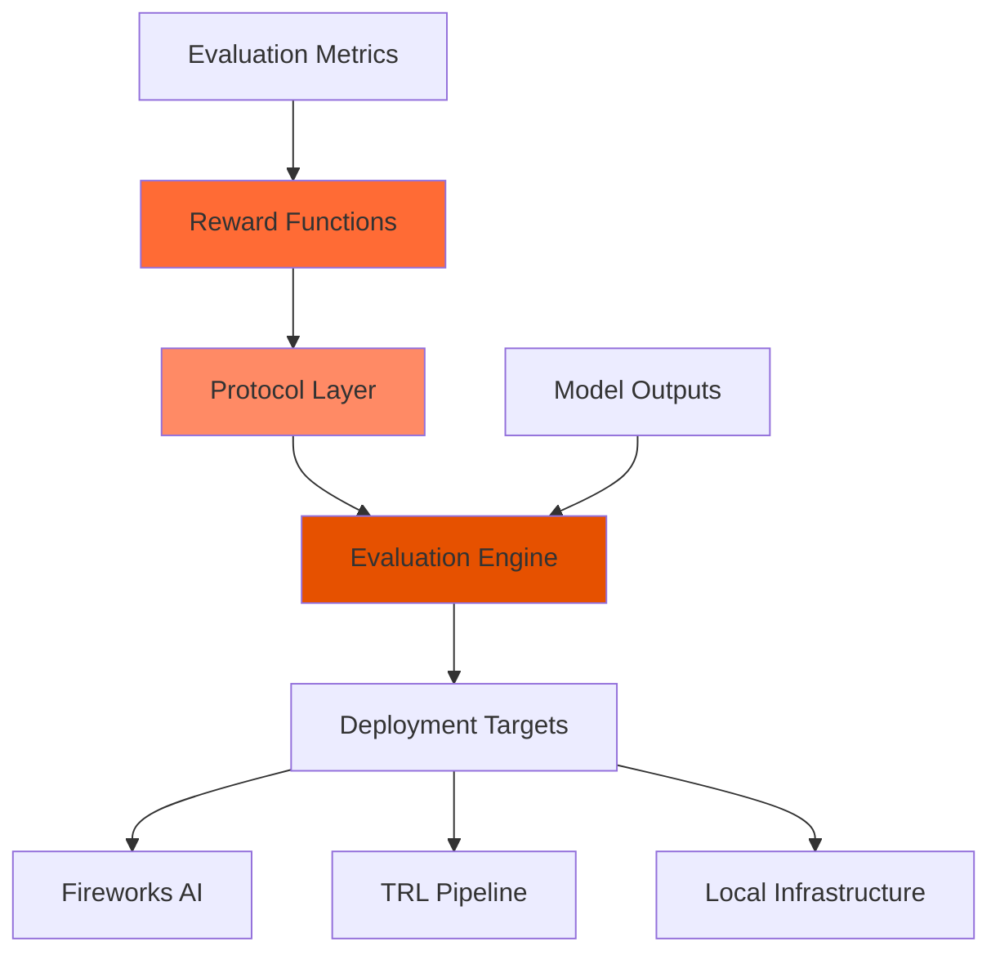

# Reward Protocol

**Author, reproduce, and evaluate reward functions seamlessly on Fireworks, TRL, and your own infrastructure.**

Reward Protocol is a standardized framework for creating, deploying, and evaluating reward functions that assess AI model outputs. It provides a unified interface for building evaluation metrics across different platforms and use cases.

## Why Reward Protocol?

Current reward function development faces several challenges:
- **Fragmentation**: Different platforms use incompatible reward function formats
- **Complexity**: Setting up evaluation pipelines requires significant boilerplate
- **Scalability**: Deploying reward functions across infrastructure is difficult
- **Reproducibility**: Sharing and reproducing evaluation results is challenging

Reward Protocol addresses these issues by providing a standardized, portable framework for reward function development and deployment.

## General Architecture

The Reward Protocol ecosystem consists of several key components:

### Core Components

- **Reward Functions**: Python functions decorated with `@reward_function` that evaluate model outputs
- **Protocol Layer**: Standardized interface for defining evaluation criteria and data types
- **Evaluation Engine**: Runtime that executes reward functions against model outputs
- **Deployment Targets**: Various platforms where reward functions can be deployed and scaled

## Key Features

<CardGroup cols={2}>
  <Card
    title="Easy-to-use Decorator"
    icon="wand-magic-sparkles"
    href="/quickstart"
  >
    Define reward functions with a simple `@reward_function` decorator
  </Card>
  <Card
    title="Local Testing"
    icon="flask"
    href="/quickstart"
  >
    Quickly test your reward functions with sample data
  </Card>
  <Card
    title="Flexible Evaluation"
    icon="chart-line"
    href="/developer-guide/getting-started"
  >
    Evaluate model outputs based on single or multiple custom metrics
  </Card>
  <Card
    title="Seamless Deployment"
    icon="rocket"
    href="/cli-reference/overview"
  >
    Deploy your reward functions to platforms like Fireworks AI
  </Card>
</CardGroup>

## Get Started

<CardGroup cols={2}>
  <Card
    title="Installation"
    icon="download"
    href="/installation"
  >
    Install Reward Protocol and set up your development environment
  </Card>
  <Card
    title="Quick Start"
    icon="bolt"
    href="/quickstart"
  >
    Create your first reward function in minutes
  </Card>
</CardGroup>

## Quick Starts

Choose your path based on your role:

<CardGroup cols={3}>
  <Card
    title="For Developers"
    icon="code"
    href="/quickstarts/developers"
  >
    Build and deploy reward functions for your applications
  </Card>
  <Card
    title="For Users"
    icon="user"
    href="/quickstarts/users"
  >
    Use existing reward functions to evaluate model outputs
  </Card>
  <Card
    title="For Integrators"
    icon="plug"
    href="/quickstarts/integrators"
  >
    Integrate Reward Protocol into your existing workflows
  </Card>
</CardGroup>

## Popular Use Cases

<CardGroup cols={2}>
  <Card
    title="Math Evaluation"
    icon="calculator"
    href="/examples/math-evaluation"
  >
    Evaluate mathematical reasoning and problem-solving
  </Card>
  <Card
    title="Code Generation"
    icon="terminal"
    href="/examples/overview"
  >
    Test and validate generated code solutions
  </Card>
  <Card
    title="Tool Calling"
    icon="tools"
    href="/examples/overview"
  >
    Verify function calling and API usage
  </Card>
  <Card
    title="Custom Metrics"
    icon="gauge"
    href="/development/getting-started"
  >
    Build domain-specific evaluation criteria
  </Card>
</CardGroup>

## Tutorials

Step-by-step guides to master Reward Protocol:

<CardGroup cols={2}>
  <Card
    title="Creating Your First Reward Function"
    icon="graduation-cap"
    href="/quickstart"
  >
    Learn the basics of defining and testing reward functions
  </Card>
  <Card
    title="Evaluating Model Responses"
    icon="chart-bar"
    href="/development/getting-started"
  >
    Best practices for comprehensive model evaluation
  </Card>
</CardGroup>

## Explore Reward Protocol

<CardGroup cols={2}>
  <Card
    title="Protocol Specification"
    icon="file-contract"
    href="/protocol/overview"
  >
    Understand the technical details of the Reward Protocol
  </Card>
  <Card
    title="Development Guide"
    icon="hammer"
    href="/development/getting-started"
  >
    Advanced patterns and best practices for developers
  </Card>
  <Card
    title="Integration Examples"
    icon="puzzle-piece"
    href="/integrations/overview"
  >
    See how Reward Protocol works with different platforms
  </Card>
  <Card
    title="Community Support"
    icon="users"
    href="/community/support"
  >
    Get help and connect with other developers
  </Card>
</CardGroup>