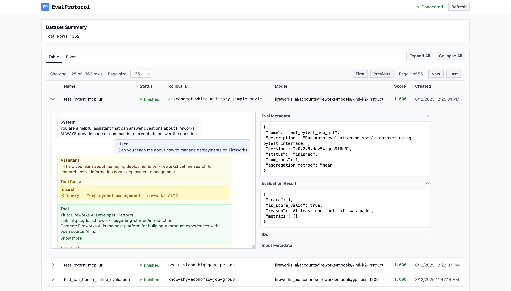

EP is an [open specification](/specification), [Python
SDK](https://github.com/eval-protocol/python-sdk), pytest wrapper, and suite of
tools that provides a standardized way to write evaluations for large language
model (LLM) applications. Start with simple single-turn evals for model
selection and prompt engineering, then scale up to complex multi-turn
reinforcement learning (RL) for agents using Model Context Protocol (MCP). EP
ensures consistent patterns for writing evals, storing traces, and saving
results—enabling you to build sophisticated agent evaluations that work across
real-world scenarios, from markdown generation tasks to customer service agents
with tool calling capabilities.

<Frame caption={<span><a href="/tutorial/reviewing-rollouts-ui">Log Viewer: Monitor your evaluation rollouts in real time.</a></span>}>
  
</Frame>


## Getting Started

Ready to dive in? Install EP with a single command and start evaluating your models:

```shell
pip install eval-protocol
```

## Quick Example

Here's a simple test function that checks if a model's response contains **bold** text formatting:

```python test_bold_format.py
from eval_protocol.models import EvaluateResult, EvaluationRow
from eval_protocol.pytest import default_single_turn_rollout_processor, evaluation_test

@evaluation_test(
    input_messages=[
        [
            Message(role="system", content="You are a helpful assistant. Use bold text to highlight important information."),
            Message(role="user", content="Explain why **evaluations** matter for building AI agents. Make it dramatic!"),
        ],
    ],
    model=["accounts/fireworks/models/llama-v3p1-8b-instruct"],
    rollout_processor=default_single_turn_rollout_processor,
    mode="pointwise",
)
def test_bold_format(row: EvaluationRow) -> EvaluationRow:
    """
    Simple evaluation that checks if the model's response contains bold text.
    """
    
    assistant_response = row.messages[-1].content
    
    # Check if response contains **bold** text
    has_bold = "**" in assistant_response
    
    if has_bold:
        result = EvaluateResult(score=1.0, reason="✅ Response contains bold text")
    else:
        result = EvaluateResult(score=0.0, reason="❌ No bold text found")
    
    row.evaluation_result = result
    return row
```

## Learn More

For a complete step-by-step tutorial of a slightly more complex example with
detailed explanations, dataset examples, and configuration options, see our
[Single-turn eval](/tutorial/single-turn-eval-static) tutorial.

For a more advanced example that includes MCP and user simulation, check out our
implementation of [𝜏²-bench](/tutorial/multi-turn-eval-user-simulation), a benchmark for evaluating conversational
agents in a dual control environment.

### Next Steps

 - [Specification](/specification)
 - [Why Eval Protocol?](/why)
 - [Principles](/principles)
 - [Single-turn eval](/tutorial/single-turn-eval-static)
 - [Multi-turn eval](/tutorial/multi-turn-eval-user-simulation)
