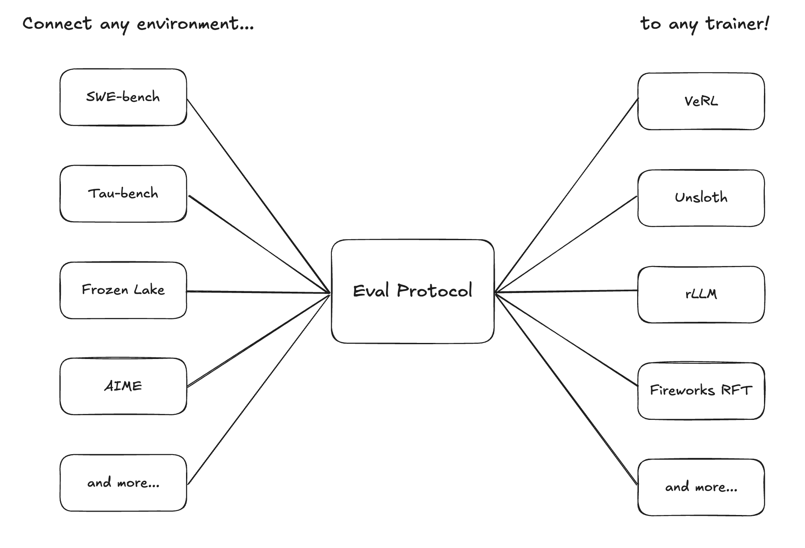

**Eval Protocol is an open standard for connecting RL environments and evaluators to training systems.**

<Frame>
  
</Frame>

Teams struggle to connect local evals and environments (tool calls, containers, artifacts) to production training systems without duplication. Eval Protocol standardizes the flow:

1. **Develop Locally**: Implement your evaluation logic once using Eval Protocol's SDK. Test and debug on your local machine with a built-in UI.
2. **Connect Anywhere**: Plug your portable evaluator into any compatible training backend—from cloud providers to open-source RL libraries.
3. **Scale Confidently**: Launch distributed training jobs, knowing the reward signal and environment logic are identical to what you validated locally.

This collapses reward shaping, environment interaction, and training into a single, reliable loop.

## Who This Is For

- **Applied Teams** who are shipping complex agents (for code-gen, tool-use, etc.) who want to use reinforcement learning to improve their agents.
- **Research Engineers** who need to quickly build practical environments and evals that map to applications in production.
- **MLOps Teams** who are responsible for creating stable, observable, and reusable evaluation infrastructure for their entire organization.

## Getting Started

Check out our Quickstart on the next page to see how we built and trained an SVGAgent end-to-end!