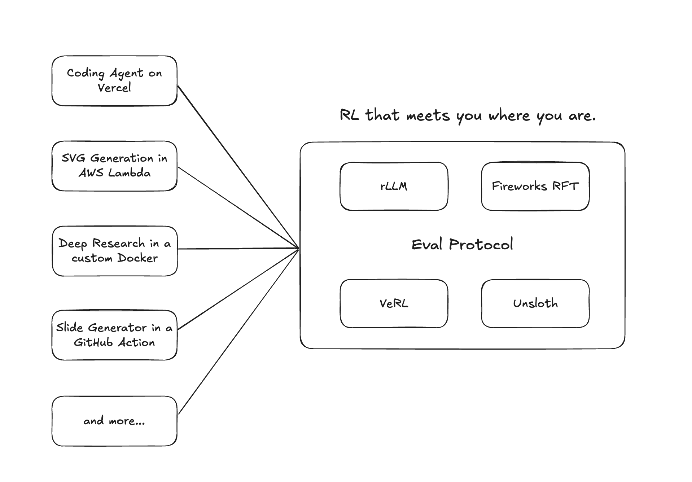

**Eval Protocol (EP) is an open solution for doing reinforcement learning fine-tuning on existing agents — across any language, container, or framework.**

<Frame>
  
</Frame>

Most teams already have complex agents running in production — often across remote services with heavy dependencies, Docker containers, or TypeScript backends deployed on Vercel. When they try to train or fine-tune these agents with reinforcement learning, connecting them to a trainer quickly becomes painful.

Eval Protocol makes this possible in two ways:

1. **Expose Your Agent Through a Simple API**
   Wrap your existing agent (Python, TypeScript, Docker, etc.) in a simple HTTP service using EP’s rollout interface. EP handles the rollout orchestration, metadata passing, and trace storage automatically.
2. **Connect With Any Trainer**
   Once your agent speaks the EP standard, it can be fine-tuned or evaluated with any supported trainer — Fireworks RFT, TRL, Unsloth, or your own — with no environment rewrites.

The result: RL that works out-of-the-box for existing production agents.

## Who This Is For

- **Applied AI teams** adding RL to existing production agents.
- **Research engineers** experimenting with fine-tuning complex, multi-turn or tool-using agents.
- **MLOps teams** building reproducible, language-agnostic rollout pipelines.

## Getting Started

Try our Quickstart to see how we built and trained an SVGAgent end-to-end using the RemoteRolloutProcessor — including full Fireworks Tracing integration.