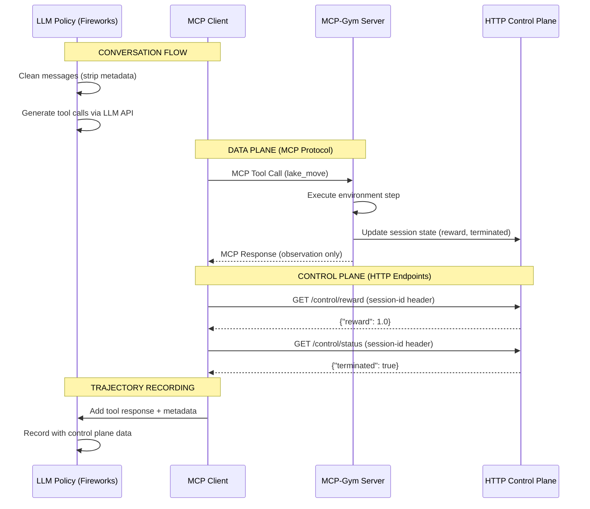

EP adopts a clear split between the data plane (MCP calls that carry observations) and the control plane (HTTP endpoints for rewards, termination, and lifecycle). This separation improves reproducibility, session awareness, and failure recovery.

EP separates agent evaluation into two independent planes: data plane (MCP tool calls carrying observations) and control plane (HTTP endpoints for rewards and termination). This architectural split prevents observation/reward coupling that breaks caching and session isolation, while enabling graceful failure recovery—if reward calculation fails, agents still receive observations and evaluations continue with safe defaults.

## The Split

- Data plane (MCP): `list_tools`, `call_tool`, `list_resources`/`read_resource`.
  - Purpose: tool schemas and observations only--what the agent receives.
- Control plane (HTTP): `/control/*` endpoints with `mcp-session-id` header.
  - Purpose: initial state, reward, status (terminated/truncated), and reset.

Separation rules:

- Observations never come from control plane endpoints.
- Rewards/termination never come from tool results.

### Sequence diagram (data vs control planes)



EP’s client enforces this separation in [MCPConnectionManager](https://github.com/eval-protocol/python-sdk/blob/main/eval_protocol/mcp/client/connection.py) and [GeneralMCPVectorEnv](https://github.com/eval-protocol/python-sdk/blob/main/eval_protocol/mcp/session/manager.py).

## Control Plane Endpoints

Servers should implement the following endpoints alongside their MCP transport (e.g., at `https://your-server.example/mcp` for MCP, and `https://your-server.example/control/...` for control):

- `POST /control/reset_session`
  - Headers: `mcp-session-id: <session_id>`
  - Body: `{ "seed": <int|null> }`
  - Use: cleanup/reseed before a rollout or at close.

- `GET /control/initial_state`
  - Headers: `mcp-session-id: <session_id>`
  - Returns: JSON initial observation/state used to seed the first user prompt.

- `GET /control/reward`
  - Headers: `mcp-session-id: <session_id>`
  - Returns: `{ "reward": <float> }` for the most recent step.

- `GET /control/status`
  - Headers: `mcp-session-id: <session_id>`
  - Returns: `{ "terminated": <bool>, "truncated": <bool> }` to indicate episode end.

Notes:

- EP generates a stable `session_id` by hashing dataset row values and the model ID via `gen_session_id(...)` and passes it in MCP `clientInfo` and as the control-plane header. Heads up: it does not use run ID, so between runs, the MCP server needs to be restarted. This is automatically done in the current implementation of `MCPGymRolloutProcessor()`.
- The simulator framework ([SimulationServerBase](https://github.com/eval-protocol/python-sdk/blob/main/eval_protocol/mcp/simulation_server.py)) demonstrates session-aware design but you still need to expose the `/control/*` endpoints in your production server. Note: the EP client does not depend on `SimulationServerBase`; it is provided as a reference pattern only.

## End-to-End Flows

### 1) Initialization

1. EP opens a streamable MCP session and sends `clientInfo` with `session_id`, `seed`, `config`, and `model_id`.
2. EP pre-warms tool schemas via `list_tools` (data plane) and caches them.
3. EP fetches initial state via `GET /control/initial_state` (control plane); if that times out or fails, it falls back to `list_resources`/`read_resource` (data plane) heuristics.
4. The initial observation seeds the first user prompt with your `user_prompt_template`.

Key guarantees:

- Initial state is session-aware (derived from control plane when available).
- Tool schemas are cached per `base_url` to avoid thundering herds.

### 2) Step Execution (per agent turn)

1. Policy returns one or more MCP tool calls based on tool schemas and conversation history.
2. EP executes the tool call via `call_tool` (data plane) and parses the observation from tool content.
3. EP queries control plane for reward and status:
   - `GET /control/reward` → scalar reward
   - `GET /control/status` → `terminated`/`truncated`
4. EP attaches a control-plane step summary to the conversation for logging, including reward, termination, and tool calls.

Separation:

- Observations never come from control plane endpoints
- Rewards/termination never come from tool results.

### 3) Termination

An episode ends when any of the following occurs:

- Control plane status reports `terminated` (environment signaled end) or `truncated` (cutoff).
- The policy returns `_no_tool_call` or `_playback_terminate` (e.g., model finished or playback hit the end).
- The simulated user signals stop; EP maps this to `termination_reason = user_stop`.

EP maps LLM finish reasons into `TerminationReason` values: `stop`, `length`, `tool_calls`, plus environment-driven `control_plane_signal`, `max_steps`, `user_stop`, `error`.

### 4) Failure Recovery

EP is defensive at the boundaries between planes:

- Initial state: If `/control/initial_state` fails or times out, EP falls back to `read_resource` (and ultimately a default observation) so rollouts can proceed.
- Tool responses: If a tool returns invalid/empty JSON, EP wraps it into a structured observation with an error tag instead of failing hard.
- Control queries: `/control/reward` and `/control/status` use short timeouts; absent data yields defaults (0.0 reward, not-terminated) and the step continues.
- Session re-init: Re-initialization closes any existing session handles and re-opens cleanly before retrying.

### 5) Cleanup

- At `close`, EP calls `POST /control/reset_session` and then closes the MCP transport.

## Minimal Client Example

```python
import eval_protocol as ep
from eval_protocol.models import EvaluationRow, Message

rows = [
    EvaluationRow(
        messages=[Message(role="system", content="Use tools to help the user.")],
        input_metadata={
            "dataset_info": {
                "user_prompt_template": "Observation: {observation}",
                "environment_context": {"seed": 123}
            }
        },
    )
]

envs = ep.make("https://your-server.example/mcp", evaluation_rows=rows, model_id="my-model")
policy = ep.OpenAIPolicy(model_id="gpt-4o-mini")

async def run():
    async for row in ep.rollout(envs, policy=policy, steps=64, openai_format_log_file="terminated.jsonl"):
        print(row.rollout_status.status, row.rollout_status.termination_reason)
```

## Multi-Server Aggregation (Optional)

If you need to aggregate tools from multiple MCP servers, EP provides [MCPMultiClient](https://github.com/eval-protocol/python-sdk/blob/main/eval_protocol/mcp/mcp_multi_client.py) that connects to both stdio and remote servers and exposes all tools under one client.

```json
{
  "mcpServers": {
    "local": { "command": "python", "args": ["-m", "my_mcp_server"], "env": ["API_KEY"] },
    "remote": { "url": "https://your-server.example/mcp" }
  }
}
```

This is independent from the control plane split; each server still implements its own `/control/*` endpoints.

## Record/Playback

Set `EP_PLAYBACK_FILE` to enable deterministic record/playback. During playback, the policy is stepped to match prior turns, and `_playback_terminate` ends the episode at the recorded boundary. Control-plane step summaries and an optional OpenAI-format log are emitted for terminated trajectories.

## Server Implementation Checklist

Use this as a reference when building the control plane alongside your MCP server.

- Headers: include `mcp-session-id` on every control request; return `Content-Type: application/json`.
- Session ID: treat as opaque but stable per dataset row + model; do not coalesce across different seeds/config.
- Idempotency: make `POST /control/reset_session` safe to call multiple times; ignore duplicate resets.
- Initialization:
  - `GET /control/initial_state` returns the initial observation JSON for this session, derived from `seed` and `config` (from MCP `clientInfo`).
  - Keep this response free of reward/termination fields; it seeds the first user prompt only.
- Step reporting:
  - `GET /control/reward` returns `{ "reward": <float> }` for the most recent applied action.
  - `GET /control/status` returns `{ "terminated": <bool>, "truncated": <bool> }` for the episode state.
  - Do not include observation content here; that stays in the data plane.
- Timeouts and SLAs:
  - EP uses ~15s timeout for initial_state under high concurrency (3s in playback) and ~3s for reward/status.
  - Aim for sub-1s responses; if computation is heavy, cache per `session_id`.
- Errors:
  - Use `4xx` for client mistakes (missing/invalid `mcp-session-id`), `5xx` for server errors.
  - On faults, respond with a minimal JSON error body; EP will default to `reward=0.0` and `terminated=false` on non-200s.
- Concurrency:
  - Expect many concurrent sessions; isolate per `session_id` and avoid global mutable state.
  - Ensure tool results (data plane) and control updates are applied atomically in your environment loop.
- Security:
  - You may authenticate control endpoints; keep auth orthogonal to `mcp-session-id` routing.
  - Validate reasonable `session_id` lengths to prevent abuse.

Example responses

```http
GET /control/initial_state
200 OK
Content-Type: application/json

{
  "observation": "initial_state",
  "grid_layout": "...",
  "session_id": "<server-side optional echo>"
}
```

```http
GET /control/reward
200 OK
Content-Type: application/json

{ "reward": 1.0 }
```

```http
GET /control/status
200 OK
Content-Type: application/json

{ "terminated": false, "truncated": false }
```

```http
POST /control/reset_session
200 OK
Content-Type: application/json

{ "ok": true }
```

## Reading clientInfo on the Server

Servers using the low-level MCP server can extract `clientInfo` extras to create stable, session-aware environments. Example:

```python
from mcp.server.lowlevel import Server

app = Server("MyServer")

@app.call_tool()
async def call_tool(name: str, arguments: dict):
    # Access per-request context
    ctx = app.request_context

    session_id = None
    seed = None
    config = {}

    if hasattr(ctx, "session") and hasattr(ctx.session, "client_params"):
        client_params = ctx.session.client_params
        if hasattr(client_params, "clientInfo"):
            client_info = client_params.clientInfo
            if client_info and hasattr(client_info, "_extra"):
                extra = client_info._extra or {}
                session_id = extra.get("session_id")
                seed = extra.get("seed")
                config = extra.get("config", {})

    env = get_or_create_env(session_id=session_id, seed=seed, config=config)
    # Apply action and return observation (data plane only)
    observation = env.step(name, arguments)
    return [{"type": "text", "text": json.dumps(observation)}]
```

Notes:

- Use `session_id` as the key for per-session state. Seed and config should shape the initial state.
- Keep observations on the data plane; publish reward and termination via `/control/*`.

## GitHub References

- Client: MCP connection manager (control/data split)
  - https://github.com/eval-protocol/python-sdk/blob/main/eval_protocol/mcp/client/connection.py
- Client: Vector env/session manager
  - https://github.com/eval-protocol/python-sdk/blob/main/eval_protocol/mcp/session/manager.py
- Server: MCP-Gym base with control-plane endpoints
  - https://github.com/eval-protocol/python-sdk/blob/main/eval_protocol/mcp/mcpgym.py
- Server: Simulation server base (session-aware patterns)
  - https://github.com/eval-protocol/python-sdk/blob/main/eval_protocol/mcp/simulation_server.py
- Example servers implementing McpGym
  - Frozen Lake: https://github.com/eval-protocol/python-sdk/blob/main/examples/frozen_lake_mcp/frozen_lake_mcp.py
  - Lunar Lander: https://github.com/eval-protocol/python-sdk/blob/main/examples/lunar_lander_mcp/lunar_lander_mcp.py
  - Cliff Walking: https://github.com/eval-protocol/python-sdk/blob/main/examples/cliff_walking_mcp/cliff_walking_mcp.py
  - Blackjack: https://github.com/eval-protocol/python-sdk/blob/main/examples/blackjack_mcp/blackjack_mcp.py
  - Tau2 domains: https://github.com/eval-protocol/python-sdk/blob/main/examples/tau2_mcp/tau2_mcp.py
